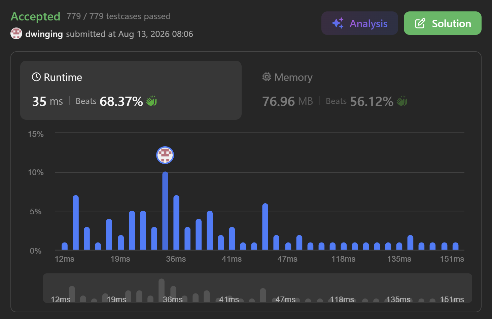
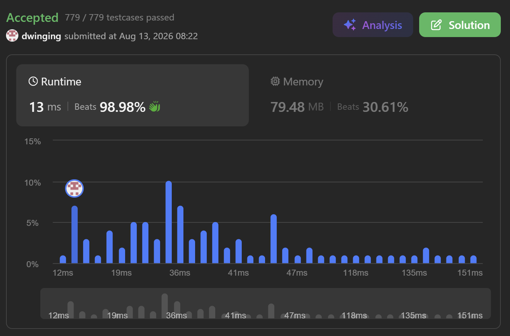

### LeetCode 2931 [Maximum Spending After Buying Items](https://leetcode.com/problems/maximum-spending-after-buying-items/description/) (Java)

> **날짜:** 2026년 8월 13일 <br>
> **알고리즘:** 그리디 <br>
> **언어:**  Java <br>
> **핵심 키워드:** 그리디

## 📌 문제 개요

* `m * n` 크기의 정수 행렬 `values`가 주어지며, 각 행은 하나의 상점을 의미한다.
* 각 상점에는 `n`개의 상품이 존재하며, `values[i][j]`는 `i`번째 상점의 `j`번째 상품 가치를 의미한다.
* 각 상점의 상품은 가치가 큰 순서대로 정렬되어 있다.

```text
values[i][j] >= values[i][j + 1]
```

* 하루에 하나의 상품만 구매할 수 있으며, 선택한 상점에서는 아직 구매하지 않은 상품 중 가장 오른쪽에 있는 상품만 구매할 수 있다.
* `d`번째 날에 가치가 `value`인 상품을 구매하면 실제 지출 금액은 다음과 같다.

```text
value * d
```

* 모든 `m * n`개의 상품을 구매해야 하며, 전체 지출 금액이 최대가 되도록 구매 순서를 결정해야 한다.

---

## 💡 풀이 핵심 (Core Logic)

### 1. 작은 값을 먼저 구매하는 것이 유리하다

* 상품의 실제 구매 가격은 `상품 가치 * 구매 날짜`로 결정된다.
* 날짜가 뒤로 갈수록 곱해지는 값 `d`가 커지므로, 큰 값은 가능한 한 늦게 구매하는 것이 전체 합을 증가시키는 데 유리하다.
* 따라서 현재 구매 가능한 상품 중 가장 작은 값을 우선 선택한다.

```text
작은 값 × 빠른 날짜
큰 값 × 늦은 날짜
```

* 두 값 `a <= b`와 두 날짜 `d1 < d2`가 있을 때 다음과 같이 배치하는 것이 더 큰 결과를 만든다.

```text
a * d1 + b * d2
```

* 따라서 매일 현재 구매 가능한 상품 중 최소값을 선택하는 그리디 방식으로 처리할 수 있다.

### 2. 각 상점에서는 가장 오른쪽 상품만 구매할 수 있다

* 각 행은 내림차순으로 정렬되어 있으므로 가장 오른쪽 상품이 해당 상점에서 현재 구매 가능한 최소값이다.
* 한 상품을 구매한 이후에는 바로 왼쪽 상품이 다음 구매 가능한 상품이 된다.

```text
[8, 5, 2]

초기 구매 가능 값: 2
2 구매 후: 5
5 구매 후: 8
```

* 따라서 각 상점마다 현재 구매 가능한 상품의 인덱스만 관리하면 된다.

### 3. 행별 현재 인덱스를 배열로 관리

* `idx[i]`를 `i`번째 상점에서 현재 구매 가능한 가장 오른쪽 상품의 인덱스로 사용한다.
* 처음에는 모든 상점에서 가장 오른쪽 상품부터 구매할 수 있으므로 다음과 같이 초기화한다.

```text
idx[i] = n - 1
```

* 특정 상점의 상품을 구매한 경우 해당 상점의 인덱스를 하나 감소시킨다.

```text
idx[selected]--
```

* 인덱스가 `0`보다 작아지면 해당 상점의 모든 상품을 구매한 상태이므로 이후 탐색에서 제외한다.

### 4. 매일 모든 상점의 현재 후보 중 최소값 선택

* 각 날짜마다 아직 상품이 남아 있는 모든 상점을 확인한다.
* 각 상점의 `values[i][idx[i]]` 중 가장 작은 값을 찾아 해당 상품을 구매한다.

```text
for each shop i:
    현재 구매 가능한 값 확인
    최소값 선택
```

* 상점의 개수 `m`이 최대 `10`으로 매우 작기 때문에, 매일 모든 상점을 직접 순회해도 충분한 성능을 확보할 수 있다.
* 우선순위 큐를 사용할 수도 있지만, 제한된 행의 개수를 고려하면 단순 탐색만으로도 효율적으로 처리할 수 있다.

### 5. 날짜와 상품 가치를 곱하여 결과 누적

* 선택한 상품의 가치가 `min`이고 현재 날짜가 `d`라면 다음 값을 전체 결과에 더한다.

```text
res += min * d
```

* 모든 상품의 가치와 날짜를 곱한 결과는 `int` 범위를 초과할 수 있으므로 결과는 `long` 타입으로 관리한다.

---

* 총 상품의 개수는 `m * n`개이며, 상품 하나를 구매할 때마다 최대 `m`개의 상점을 확인한다.
* 따라서 시간 복잡도는 다음과 같다.

```text
시간 복잡도: O(m² * n)
공간 복잡도: O(m)
```

* `m <= 10`이므로 실제 연산량은 충분히 작으며, 별도의 우선순위 큐 없이 단순 배열 탐색만으로 해결할 수 있다.

---

## 🧠 회고 및 결론

우선 순위 큐를 쓰는 대표적인 유형의 문제다. 각 행의 마지막 값을 int[] 을 사용하는 것이 특징이다.

재밌는 점은 이론상 우선 순위 큐를 쓰는게 유리한데, 값이 작아서 매번 작은 값을 탐색하는 것이 더 빠르다.

---

### 📂 소스 코드
* [우선 순위 큐 풀이](./Solution_PriorityQueue.java)
* [배열 풀이](./Solution_Array.java)
 
---

### 🖥️ 실행 결과

 <br> 우선 순위 큐 풀이 <br><br>
 <br> 배열 풀이

---