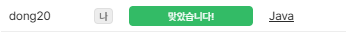

### 코드트리 - [해적 선장 코디](https://www.codetree.ai/ko/frequent-problems/samsung-sw/problems/pirate-captain-coddy/description) (Java)

> **날짜:** 2026년 8월 14일 <br>
> **알고리즘:** 시뮬레이션, 자료구조, 우선순위 큐<br>
> **언어:**  Java <br>
> **핵심 키워드:** 우선순위 큐, 지연 삭제

## 📌 문제 개요

* 총 `T`개의 명령을 순차적으로 처리하며, 각 명령은 `1시간` 간격으로 수행된다.
* 선박은 다음 정보를 가진다.

```text
id : 선박 번호
p  : 공격력
r  : 재장전 시간
```

* 선박의 상태는 크게 두 가지로 구분된다.

```text
사격 대기
재장전
```

* 명령은 총 네 종류이다.

### 1. 공격 준비

* 초기 `N`척의 선박 정보를 등록한다.
* 모든 선박은 처음에는 사격 대기 상태이다.

### 2. 지원 요청

* 새로운 선박을 추가한다.
* 새로 추가된 선박 역시 사격 대기 상태로 시작한다.

### 3. 함포 교체

* 특정 선박의 공격력을 새로운 값으로 변경한다.

### 4. 공격 명령

* 현재 사격 대기 상태인 선박 중 최대 `5척`을 선택한다.
* 우선순위는 다음과 같다.

```text
1. 공격력이 높은 선박
2. 공격력이 같다면 선박 번호가 작은 선박
```

* 선택된 선박의 공격력 합을 피해량으로 계산한다.
* 공격한 선박은 재장전 상태로 변경되며, 재장전 시간이 끝난 이후 다시 사격 대기 상태가 된다.
* 공격 명령마다 총 피해량, 공격한 선박 수, 공격 순서에 따른 선박 번호를 출력해야 한다.

---

## 💡 풀이 핵심 (Core Logic)

### 1. 선박의 현재 상태는 `Map`으로 관리한다

* 선박 번호를 기준으로 공격력, 재장전 시간, 상태 등의 현재 정보를 관리한다.
* 함포 교체와 같이 특정 선박의 정보를 직접 변경해야 하므로 `HashMap`을 사용한다.

```text
id -> Ship
```

* 각 선박은 다음 정보를 관리한다.

```text
공격력
재장전 시간
현재 버전
재장전 종료 시간
현재 상태
```

### 2. 사격 대기와 재장전 상태를 두 개의 우선순위 큐로 분리한다

두 상태는 필요한 정렬 기준이 서로 다르므로 각각 별도의 우선순위 큐로 관리한다.

#### 사격 대기 큐

공격 명령에서 바로 사용할 수 있는 선박만 저장한다.

```text
1. 공격력 내림차순
2. 선박 번호 오름차순
```

따라서 공격 명령이 들어오면 큐에서 최대 `5척`을 순서대로 꺼내면 된다.

#### 재장전 큐

재장전 중인 선박을 다시 사격 대기 상태로 전환하기 위해 사용한다.

```text
재장전 종료 시간 오름차순
```

현재 명령 시간이 재장전 종료 시간 이상이 되면 해당 선박을 사격 대기 큐로 이동시킨다.

### 3. 공격 명령 이전에 재장전이 완료된 선박을 복귀시킨다

공격 명령이 수행되는 시점 `time`을 기준으로 재장전 큐를 확인한다.

```text
reloadTime <= time
```

조건을 만족하는 선박은 재장전이 끝난 상태이므로 사격 대기 큐로 이동시킨다.

재장전 큐가 종료 시간 기준 최소 힙이므로, 조건을 만족하지 않는 선박이 등장하면 이후 선박도 아직 재장전이 끝나지 않은 상태이다.

### 4. 함포 교체는 지연 삭제(Lazy Deletion)로 처리한다

우선순위 큐 내부에 저장된 값은 임의 위치에서 직접 수정할 수 없다.

함포가 교체될 때 기존 데이터를 탐색하여 제거하는 대신, 선박마다 `버전`을 관리한다.

```text
함포 교체
-> 공격력 변경
-> 버전 증가
-> 새로운 정보를 PQ에 추가
```

PQ에서 데이터를 꺼낼 때 현재 `Map`에 저장된 버전과 비교한다.

```text
PQ의 버전 < 현재 버전
-> 오래된 데이터
-> 무시
```

이를 통해 우선순위 큐 내부에서 기존 데이터를 직접 삭제하지 않고도 최신 상태만 사용할 수 있다.

### 5. 공격 가능한 선박만 사격 대기 큐에 유지한다

공격 명령에서는 사격 대기 큐에서 최대 `5척`만 선택한다.

```text
ready.poll()
```

선택된 선박은 다음과 같이 처리한다.

```text
피해량 += 공격력
사격 선박 수 증가
재장전 종료 시간 계산
사격 대기 -> 재장전 상태 변경
재장전 큐에 추가
```

따라서 공격할 수 없는 선박을 매번 탐색할 필요 없이, 현재 실제로 공격 가능한 선박만 대상으로 처리할 수 있다.

### 6. 전체 흐름

```text
명령 입력

공격 준비 / 지원 요청
-> Map 등록
-> 사격 대기 PQ 추가

함포 교체
-> Map의 공격력 변경
-> 버전 증가
-> 현재 상태에 맞는 PQ에 새로운 정보 추가

공격 명령
-> 재장전 완료 선박 복귀
-> 사격 대기 PQ에서 최대 5척 선택
-> 피해량 계산
-> 선택된 선박을 재장전 PQ로 이동
```

* 각 선박의 현재 상태는 `Map`에서 관리하고, 두 개의 우선순위 큐는 각 상태에서 필요한 우선순위를 관리한다.
* 함포 교체로 인해 발생하는 기존 PQ 데이터는 버전 정보를 이용한 지연 삭제 방식으로 처리한다.
* 이를 통해 선박을 직접 탐색하거나 정렬하지 않고 각 명령을 효율적으로 처리할 수 있다.

---

## 🧠 회고 및 결론
 
우선순위 큐를 2개 사용하고, 지연 삭제 처리하는 익숙한 유형의 문제다. B형 공부할 때 정말 자주 보았던 유형이고, 범위가 작아서 훨씬 수월하게 풀 수 있었다.

---

### 📂 소스 코드
*   [Solution.java](./Solution.java)
 
---

### 🖥️ 실행 결과



---