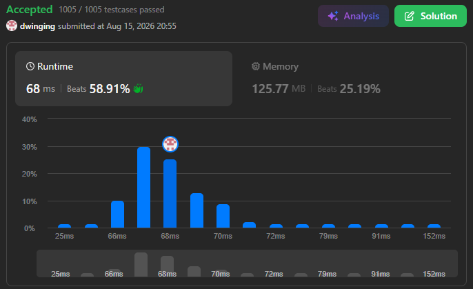

### LeetCode 3457 [Eat Pizzas!](https://leetcode.com/problems/eat-pizzas/description/) (Java)

> **날짜:** 2026년 8월 15일 <br>
> **알고리즘:** 그리디 <br>
> **언어:**  Java <br>
> **핵심 키워드:** 그리디

## 📌 문제 개요

* 정수 배열 `pizzas`가 주어지며, `pizzas[i]`는 각 피자의 무게를 의미한다.
* 매일 정확히 4개의 피자를 먹으며, 선택한 피자의 무게를 `W <= X <= Y <= Z`라고 할 때 증가하는 무게는 날짜에 따라 달라진다.

```text
홀수 번째 날: Z
짝수 번째 날: Y
```

* 모든 피자를 한 번씩 사용하여, 최종적으로 증가하는 전체 무게의 합을 최대화해야 한다.

---

## 💡 풀이 핵심 (Core Logic)

### 1. 피자를 오름차순으로 정렬

* 큰 값을 최대한 점수로 사용하기 위해 배열을 오름차순으로 정렬한다.
* 이후 가장 큰 값부터 역순으로 확인하며 필요한 값만 선택한다.

### 2. 홀수 번째 날을 먼저 처리

* 홀수 번째 날에는 선택한 4개의 피자 중 가장 큰 값 `Z`가 그대로 점수가 된다.
* 따라서 가장 큰 값들은 홀수 번째 날에 사용하는 것이 가장 유리하다.
* 전체 날짜 수가 `day`라면 홀수 번째 날의 개수는 다음과 같다.

```text
(day + 1) / 2
```

* 정렬된 배열의 뒤에서부터 홀수 번째 날의 개수만큼 값을 결과에 더한다.

### 3. 짝수 번째 날은 두 번째로 큰 값을 선택

* 짝수 번째 날에는 가장 큰 값 `Z`가 아닌 두 번째로 큰 값 `Y`가 점수가 된다.
* 따라서 현재 남아 있는 값 중 가장 큰 값 하나는 `Z`로 사용하고, 그다음 값을 `Y`로 결과에 더한다.

```text
... Y, Z

Z: 점수에 포함되지 않음
Y: 결과에 포함
```

* 짝수 번째 날마다 큰 값 두 개를 소비하므로 인덱스를 2씩 감소시킨다.

### 4. 작은 값들은 나머지 자리로 사용

* 각 날짜마다 필요한 `W`, `X`는 점수에 직접 영향을 주지 않는다.
* 따라서 큰 값들을 점수 계산에 우선 배치하고, 남은 작은 값들은 `W`, `X` 위치에 사용하면 된다.

---

* 정렬에 `O(n log n)`이 필요하며, 이후 배열을 한 번 순회하는 수준으로 처리한다.

```text
시간 복잡도: O(n log n)
공간 복잡도: O(1)
```

* 정렬 이후 홀수 번째 날과 짝수 번째 날에서 점수로 사용할 값의 위치만 결정하면 해결할 수 있다.

---

## 🧠 회고 및 결론
 
그리디 유형으로 문제 로직을 이해하면 쉽게 풀 수 있는 문제다.

---

### 📂 소스 코드
*   [Solution.java](./Solution.java)
 
---

### 🖥️ 실행 결과



---