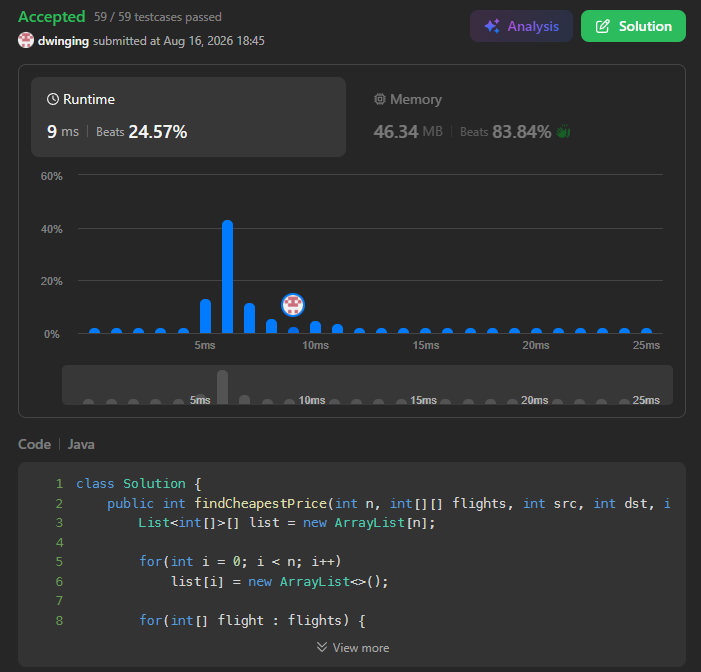

### LeetCode 787 [Cheapest Flights Within K Stops](https://leetcode.com/problems/cheapest-flights-within-k-stops/description/) (Java)

> **날짜:** 2026년 8월 16일 <br>
> **알고리즘:** 다익스트라 <br>
> **언어:**  Java <br>
> **핵심 키워드:** 다익스트라

## 📌 문제 개요

* `n`개의 도시와 도시 간 항공편 정보가 주어진다.
* `flights[i] = [from, to, price]`는 `from` 도시에서 `to` 도시로 이동하는 항공편과 비용을 의미한다.
* 출발 도시 `src`에서 도착 도시 `dst`까지 이동해야 하며, 최대 `k`개의 중간 도시를 경유할 수 있다.
* 조건을 만족하는 경로 중 최소 비용을 반환하며, 가능한 경로가 없으면 `-1`을 반환한다.

---

## 💡 풀이 핵심 (Core Logic)

### 1. 경유 횟수를 상태에 포함한 다익스트라

* 일반적인 다익스트라는 각 정점까지의 최소 비용만 관리하지만, 해당 문제는 경유 횟수 제한이 존재한다.
* 따라서 현재 도시뿐만 아니라 사용한 항공편의 수를 함께 상태로 관리한다.

```text
현재 상태: [도시, 누적 비용, 사용한 항공편 수]
```

* 중간 경유지가 최대 `k`개이므로 실제 사용할 수 있는 항공편의 수는 최대 `k + 1`개이다.

### 2. 도시와 이동 횟수별 최소 비용 관리

* 동일한 도시라도 몇 번의 이동을 통해 도착했는지에 따라 이후 선택 가능한 경로가 달라질 수 있다.
* 따라서 최소 비용을 다음과 같이 관리한다.

```text
dist[city][count]
```

* `count`는 해당 도시까지 도달하는 데 사용한 항공편의 수를 의미한다.

### 3. 우선순위 큐를 이용한 최소 비용 탐색

* 누적 비용이 가장 작은 상태부터 처리하도록 우선순위 큐를 사용한다.
* 현재 도시에서 연결된 항공편을 확인하고, 이동 횟수가 `k + 1`을 초과하지 않는 경우에만 다음 상태를 탐색한다.
* 같은 도시와 같은 이동 횟수에 대해 기존보다 더 작은 비용으로 도달한 경우에만 갱신한다.

### 4. 목적지 도착 시 즉시 반환

* 우선순위 큐는 누적 비용이 작은 상태부터 처리한다.
* 따라서 `dst`가 처음 큐에서 추출되는 시점의 비용이 조건을 만족하는 최소 비용이다.
* 탐색이 종료될 때까지 목적지에 도달하지 못한 경우 `-1`을 반환한다.

---

* 인접 리스트를 사용하여 항공편 정보를 관리하고, 각 상태를 우선순위 큐로 탐색한다.

```text
시간 복잡도: O((n * k + E) log(n * k))
공간 복잡도: O(n * k + E)
```

* 핵심은 일반 다익스트라에 `이동 횟수` 상태를 추가하여 경유 제한을 함께 관리하는 것이다.

---

## 🧠 회고 및 결론
 
K번 경유가 가능해서 최대 방문 가능한 지점은 K + 2개가 된다.

---

### 📂 소스 코드
*   [Solution.java](./Solution.java)
 
---

### 🖥️ 실행 결과



---