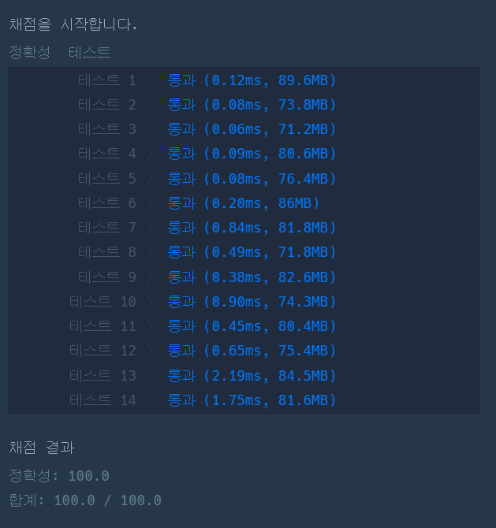

### 프로그래머스 Lv3 [블록 이동하기](https://school.programmers.co.kr/learn/courses/30/lessons/60063) (Java)

> **날짜:** 2026년 8월 19일 <br>
> **알고리즘:** 시뮬레이션, BFS<br>
> **언어:**  Java <br>
> **핵심 키워드:** 시뮬레이션, BFS

## 📌 문제 개요

* `N x N` 크기의 지도에서 `2 x 1` 크기의 로봇을 `(N, N)` 위치까지 이동시키는 문제이다.
* `0`은 빈칸, `1`은 벽을 의미하며 로봇은 벽이나 지도 밖으로 이동할 수 없다.
* 로봇은 처음에 `(1, 1)`, `(1, 2)` 위치에 가로 방향으로 놓여 있다.
* 로봇은 현재 방향을 유지한 채 상하좌우로 이동할 수 있다.
* 로봇이 차지하는 두 칸 중 하나를 축으로 90도 회전할 수 있다.
* 이동 또는 회전에는 각각 `1초`가 소요된다.
* 로봇이 차지하는 두 칸 중 하나라도 `(N, N)`에 도착하는 최소 시간을 구한다.

---

## 💡 풀이 핵심 (Core Logic)

### 1. 로봇의 상태 정의

* 로봇의 상태를 단순 좌표가 아닌 **위치와 방향을 포함한 상태**로 관리한다.
* 한쪽 칸의 좌표와 로봇의 방향을 기준으로 다른 한쪽 칸의 위치를 계산할 수 있다.
* 같은 위치라도 가로 상태와 세로 상태는 서로 다른 상태로 처리해야 한다.

### 2. BFS를 통한 최소 시간 탐색

* 모든 이동과 회전의 비용이 동일하게 `1초`이므로 BFS를 사용한다.
* 현재 상태에서 가능한 모든 다음 상태를 큐에 추가한다.
* 목적지 `(N, N)`을 포함하는 상태를 처음 만났을 때의 시간이 최소 시간이 된다.

### 3. 평행 이동 처리

* 로봇은 현재 방향을 유지한 채 상하좌우로 한 칸 이동할 수 있다.
* 이동 후 로봇이 차지하는 두 칸이 모두 지도 내부이며 빈칸인 경우에만 이동할 수 있다.

### 4. 회전 처리

* 로봇이 가로 상태이면 위 또는 아래 방향으로 회전할 수 있다.
* 로봇이 세로 상태이면 왼쪽 또는 오른쪽 방향으로 회전할 수 있다.
* 두 칸 중 어느 칸이든 회전축이 될 수 있으므로 한 방향당 최대 두 개의 회전 상태가 생성된다.
* 회전하려는 방향의 두 칸이 모두 빈칸인 경우에만 회전이 가능하다.

### 5. 방문 상태 관리

* 동일한 위치와 방향의 상태를 다시 탐색하지 않도록 방문 여부를 저장한다.
* 로봇의 방향까지 방문 상태에 포함하여 중복 탐색을 방지한다.

---

```text
시간 복잡도: O(N²)
공간 복잡도: O(N²)
```

* 핵심은 **로봇의 위치와 방향을 하나의 상태로 정의하고, 평행 이동과 회전으로 생성되는 모든 상태를 BFS로 탐색하는 것**이다.

---

## 🧠 회고 및 결론

이동 가능한 경우의 수가 많은 시뮬레이션 유형의 BFS 문제다. 반복되는 이동 및 방문 처리 로직을 함수로 분리하면 구현 과정에서 발생할 수 있는 실수를 줄일 수 있다.

시뮬레이션 문제이기 때문에 이동 조건 자체는 하나씩 구현하면 되지만, 핵심은 로봇의 상태를 어떻게 정의하고 방문 여부를 관리할 것인가였다.

두 칸의 좌표를 문자열 등으로 묶어 관리하는 방법도 있지만, 한 칸을 기준으로 다른 칸이 연결된 방향을 상태로 표현하여 3차원 배열로 방문 여부를 관리하였다.

로직 자체보다 이동과 회전 조건이 많아 구현 과정에서 실수하기 쉬운 문제였다. 문제를 꼼꼼히 읽자.

---

### 📂 소스 코드
*   [Solution.java](./Solution.java)
 
---

### 🖥️ 실행 결과



---