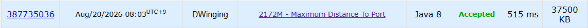

### Codeforces 2172M [Maximum Distance To Port](https://codeforces.com/problemset/problem/2172/M) (Java)

> **날짜:** 2026년 8월 20일 <br>
> **알고리즘:** BFS <br>
> **언어:**  Java <br>
> **핵심 키워드:** BFS

## 📌 문제 개요

* `n`개의 도시가 `m`개의 양방향 도로로 연결되어 있으며, 모든 도로의 길이는 `1km`이다.

* 각 도시는 `1`부터 `k`까지의 농산물 종류 중 하나를 생산한다.

* `1`번 도시는 모든 농산물이 운송되는 항구 도시이다.

* 각 농산물 종류마다 해당 농산물을 생산하는 모든 도시에서 `1`번 도시까지의 최단 거리를 구한다.

* 이 중 가장 긴 최단 거리를 해당 농산물 종류의 결과값으로 사용한다.

* 모든 농산물 종류에 대해 최대 최단 거리를 출력한다.

---

## 💡 풀이 핵심 (Core Logic)

### 1. 그래프 구성

* 각 도시는 정점, 도로는 간선으로 표현한다.

* 모든 도로의 길이가 동일하고 양방향이므로 인접 리스트를 사용하여 그래프를 구성한다.

### 2. BFS를 통한 최단 거리 탐색

* 모든 간선의 비용이 동일하게 `1`이므로 `1`번 도시를 시작점으로 BFS를 수행한다.

* BFS 과정에서 각 도시까지의 최단 거리를 계산한다.

* 특정 도시를 처음 방문했을 때의 거리가 `1`번 도시로부터의 최단 거리가 된다.

### 3. 농산물 종류별 최댓값 갱신

* 각 도시를 방문할 때 해당 도시가 생산하는 농산물 종류를 확인한다.

* 현재 도시까지의 최단 거리를 이용하여 해당 농산물 종류의 최대 거리를 갱신한다.

```text
answer[type] = max(answer[type], distance[city])
```

* 동일한 농산물을 생산하는 여러 도시 중 가장 먼 도시의 최단 거리가 최종 결과가 된다.

### 4. 방문 상태 관리

* 동일한 도시를 다시 탐색하지 않도록 방문 여부 또는 거리 배열을 사용한다.

* BFS 특성상 처음 방문한 시점에 최단 거리가 확정되므로 이후에는 다시 탐색할 필요가 없다.

### 5. 결과 출력

* BFS가 종료되면 `1`번부터 `k`번 농산물까지 저장된 최대 거리를 순서대로 출력한다.

---

```text
시간 복잡도: O(N + M)

공간 복잡도: O(N + M)
```

* 핵심은 **1번 도시에서 BFS를 한 번 수행하여 모든 도시까지의 최단 거리를 구하고, 탐색 과정에서 농산물 종류별 최대 최단 거리를 갱신하는 것**이다.

---

## 🧠 회고 및 결론

Codeforces를 처음 풀어봤는데, 간단한 그래프 문제에 값을 갱신하는 유형의 문제였다. Codeforces 난이도 기준을 아직 잘 몰라서 더 풀어봐야 할 것 같다.

---

### 📂 소스 코드
*   [Solution.java](./Solution.java)
 
---

### 🖥️ 실행 결과



---