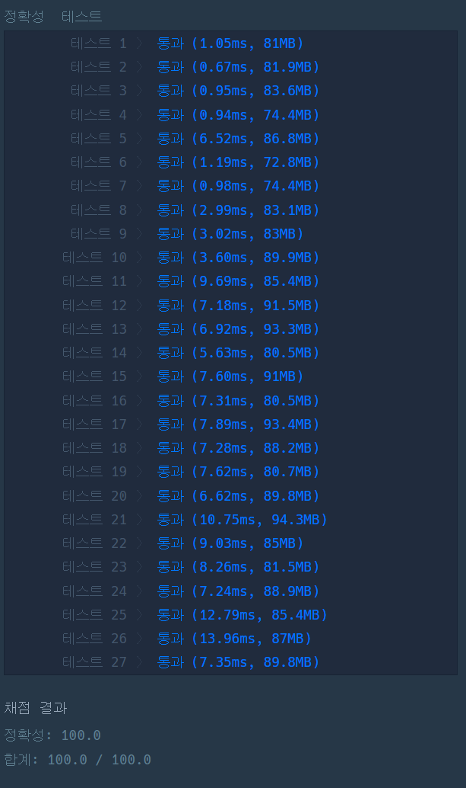

### 프로그래머스 Lv4 [미로 탈출](https://school.programmers.co.kr/learn/courses/30/lessons/81304) (Java)

> **날짜:** 2026년 8월 21일 <br>
> **알고리즘:** 다익스트라, 그래프 탐색, 비트마스킹<br>
> **언어:**  Java <br>
> **핵심 키워드:** 다익스트라, 그래프 탐색, 비트마스킹

## 📌 문제 개요

* `n`개의 방과 방향성을 가진 통로가 존재하며, 각 통로마다 이동 시간이 주어진다.
* 출발 방 `start`에서 도착 방 `end`까지 이동하는 최소 시간을 구한다.
* 일부 방은 `trap`으로 지정되어 있으며, trap에 진입하는 순간 해당 방과 연결된 모든 통로의 방향이 반전된다.
* 동일한 trap을 다시 방문하면 해당 trap의 활성 상태가 다시 반전되며, 연결된 통로 역시 원래 방향으로 돌아간다.
* 따라서 현재 이동 가능한 통로의 방향은 단순히 초기 그래프만으로 판단할 수 없으며, 지금까지 방문한 trap들의 활성 상태를 함께 고려해야 한다.

---

## 💡 풀이 핵심 (Core Logic)

### 1. 정방향 / 역방향 그래프 구성

각 통로 `P → Q`에 대해 두 개의 인접 리스트를 구성한다.

* `forward[P]` : 원래 방향인 `P → Q`
* `backward[Q]` : 방향이 반전되었을 때 사용할 `Q → P`

trap 상태에 따라 통로의 방향이 계속 변경되므로, 두 방향을 모두 저장한 뒤 현재 상태에서 실제로 이동 가능한 방향인지 판단한다.

### 2. 비트마스킹을 통한 trap 상태 관리

trap의 개수는 최대 `10`개이므로 각 trap의 활성 여부를 하나의 비트마스크로 관리할 수 있다.

```text
0 : 비활성 상태
1 : 활성 상태
```

특정 trap에 진입하면 해당 비트를 XOR 연산으로 반전한다.

```java
mark ^= (1 << trapIndex);
```

따라서 다익스트라의 상태는 단순한 `현재 방`이 아니라 다음과 같이 정의한다.

```text
(현재 방, 현재 trap 활성 상태)
```

이를 기준으로 최소 거리를 관리한다.

```text
visited[node][mark]
```

### 3. 양 끝점의 trap 상태로 통로 방향 판단

통로 `P ↔ Q`의 현재 방향은 `P`와 `Q`의 trap 활성 상태에 따라 결정된다.

두 방의 활성 상태가 서로 다르면 통로의 방향이 한 번 반전된 상태이고, 서로 같으면 원래 방향을 유지한다.

```java
boolean reversed = pActive ^ qActive;
```

이를 현재 확인 중인 통로가 정방향인지 역방향인지와 비교하여 실제 이동 가능 여부를 판단한다.

### 4. 상태 확장 다익스트라

통로마다 이동 시간이 서로 다르므로 우선순위 큐를 이용한 다익스트라를 수행한다.

우선순위 큐에는 다음 정보를 저장한다.

```text
{현재 방, 누적 이동 시간, trap 비트마스크}
```

다음 방이 trap인 경우 진입 직후 해당 trap의 상태를 반전시키고, 변경된 상태를 기준으로 최단 거리를 갱신한다.

```java
int nextMark = mark;

if (trapIndex >= 0) {
    nextMark ^= (1 << trapIndex);
}
```

즉 동일한 방이라도 trap 활성 상태가 다르면 서로 다른 탐색 상태로 처리해야 한다.

---

## 🛠 트러블 슈팅

### 방문 예정 위치의 trap 상태를 고려하지 않은 문제

초기 구현에서는 현재 위치의 trap 상태만을 기준으로 통로의 방향을 결정하였다.

하지만 하나의 통로는 양 끝점에 연결되어 있으므로, 현재 방뿐만 아니라 **이동하려는 방의 trap 활성 상태 역시 통로 방향에 영향을 준다.**

예를 들어 두 방의 trap 활성 여부가 다음과 같다면,

```text
현재 방 OFF / 다음 방 OFF
현재 방 ON  / 다음 방 OFF
현재 방 OFF / 다음 방 ON
현재 방 ON  / 다음 방 ON
```

통로가 반전되는 경우는 두 활성 상태가 서로 다른 경우이다.

따라서 기존의 현재 위치 기준 방향 판단을 제거하고, 두 방의 활성 상태를 XOR하여 통로의 실제 방향을 결정하도록 수정하였다.

```java
boolean reversed = pActive ^ qActive;
```

또한 다음 방이 trap인 경우에는 진입 직후 상태가 변경되므로, 기존 비트마스크가 아닌 변경된 `nextMark`를 기준으로 최단 거리를 비교해야 한다.

```java
visited[next][nextMark]
```

이를 통해 **그래프의 정점뿐만 아니라 trap 상태까지 포함한 확장 상태 그래프**에서 올바른 최단 경로를 탐색할 수 있다.

---

```text
상태 수: O(N × 2^T)
시간 복잡도: O((N × 2^T + M × 2^T) log(N × 2^T))
공간 복잡도: O(N × 2^T + M)
```

* `N` : 방의 개수
* `M` : 통로의 개수
* `T` : trap의 개수 (`T ≤ 10`)

핵심은 **trap 활성 상태를 비트마스크로 관리하고, 양 끝점의 활성 상태 XOR을 통해 현재 통로의 방향을 판단한 뒤 `(현재 방, trap 상태)`를 하나의 다익스트라 상태로 탐색하는 것**이다.

---

## 🧠 회고 및 결론
 
방문 예정 위치의 트랩까지 고려해야하는 상당히 까다로운 유형의 문제였다.

함정을 관리해야한다 라는 점에서 비트마스킹을 떠올렸고, 간선의 가중치가 있다는 점에서 다익스트라임을 파악할 수 있었다. 또한 일방향 그래프 구성이고, 트랩을 밟게 되면 방향이 바뀐다는 점에서 정방향과 역방향을 관리해야한다고 생각했다.

트랩의 개수가 최대 10개이므로, 특정 정점이 트랩인지 확인하는 과정은 매번 선형 탐색으로 처리해도 충분하다고 판단했다.

다만, 초기 구현에서 현재 위치의 트랩 상태만 고려하고 방문 예정 위치의 트랩 활성 상태를 함께 고려하지 못한 점은 아쉬웠다.

---

### 📂 소스 코드
*   [Solution.java](./Solution.java)
 
---

### 🖥️ 실행 결과



---