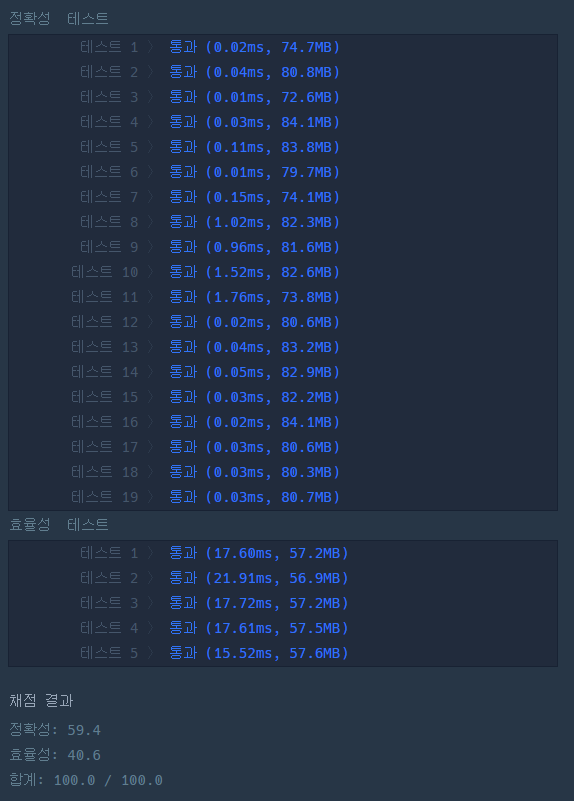

### 프로그래머스 Lv3 [단어 퍼즐](https://school.programmers.co.kr/learn/courses/18/lessons/1882) (Java)

> **날짜:** 2026년 8월 22일 <br>
> **알고리즘:** DP <br>
> **언어:**  Java <br>
> **핵심 키워드:** DP

## 📌 문제 개요

* 주어진 단어 조각들을 조합하여 문자열 `t`를 완성해야 한다.

* 각 단어 조각은 제한 없이 여러 번 사용할 수 있다.

* 문자열의 앞부분부터 단어 조각을 이어 붙이며 전체 문자열을 완성해야 한다.

* 문자열을 완성하는 데 필요한 단어 조각 개수의 최솟값을 구한다.

* 주어진 단어 조각으로 문자열을 완성할 수 없는 경우 `-1`을 반환한다.

---

## 💡 풀이 핵심 (Core Logic)

### 1. 완성 위치를 기준으로 DP 정의

`dp[i]`를 문자열 `t`의 앞에서부터 `i`번째 위치까지 완성하는 데 필요한 최소 단어 조각 수로 정의한다.

```text
dp[i] = t[0...i-1]을 완성하는 최소 단어 조각 수
```

초기 상태는 아무 문자도 완성하지 않은 상태이므로 다음과 같다.

```text
dp[0] = 0
```

### 2. 현재 위치에서 사용 가능한 단어 조각 탐색

현재 위치 `i`까지 문자열을 완성할 수 있는 경우, 각 단어 조각이 `t`의 `i`번째 위치부터 일치하는지 확인한다.

단어 조각 `str`이 현재 위치에서 사용할 수 있다면 다음 위치는 다음과 같다.

```text
next = i + str.length()
```

이후 해당 위치의 최소 단어 조각 수를 갱신한다.

```java
dp[next] = Math.min(dp[next], dp[i] + 1);
```

### 3. 도달 가능한 상태만 탐색

현재 위치까지 문자열을 완성할 수 없는 경우 이후 상태로 이동할 수 없으므로 탐색하지 않는다.

```java
if (dp[i] == INF) continue;
```

이를 통해 불필요한 문자열 비교를 줄일 수 있다.

### 4. 최종 위치의 DP 값 확인

문자열 전체 길이를 `n`이라고 할 때 `dp[n]`이 문자열 전체를 완성하는 데 필요한 최소 단어 조각 수가 된다.

끝까지 도달할 수 없는 경우에는 `-1`을 반환한다.

```java
return dp[n] == INF ? -1 : dp[n];
```

---

## 🧠 회고 및 결론

배낭 문제 유형을 응용하는 DP 문제였다. 문자의 종류가 최대 100개, 각 문자는 무한개로 있다는 가정에서 백트래킹이 아닌 DP 유형이라고 생각했다. 그러나 DP에서 관리하는 값을 찾는 것이 까다로웠다.

---

### 📂 소스 코드
*   [Solution.java](./Solution.java)
 
---

### 🖥️ 실행 결과



---