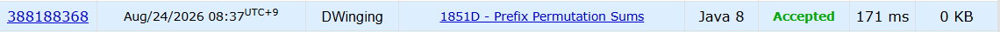

### Codeforces 1851D [Prefix Permutation Sums](https://codeforces.com/problemset/problem/1851/D) (Java)

> **날짜:** 2026년 8월 24일 <br>
> **알고리즘:** 누적 합<br>
> **언어:**  Java <br>
> **핵심 키워드:** 누적 합

## 📌 문제 개요

* `1`부터 `n`까지의 수를 한 번씩 사용하는 순열이 주어진다고 가정한다.
* 해당 순열의 누적합 배열에서 원소 하나가 누락된 상태의 배열이 주어진다.
* 주어진 `n - 1`개의 누적합 값이 실제 어떤 순열에서 만들어질 수 있는지 판별해야 한다.
* 가능한 경우 `"YES"`, 불가능한 경우 `"NO"`를 출력한다.

---

## 💡 풀이 핵심 (Core Logic)

### 1. 누적합의 차이값으로 원래 순열의 값을 복원

누적합 배열에서 인접한 값의 차이를 구하면 원래 순열의 원소를 확인할 수 있다.

```text
diff[i] = prefix[i] - prefix[i - 1]
```

첫 번째 값은 이전 누적합이 `0`이라고 생각하여 계산한다.

```text
diff[0] = prefix[0]
```

정상적인 경우 각 차이값은 `1`부터 `n` 사이의 서로 다른 값이어야 한다.

---

### 2. 정상적으로 등장한 값을 기록

각 차이값이 다음 조건을 만족하면 순열의 정상적인 원소로 판단한다.

```text
1 <= diff <= n
아직 등장하지 않은 값
```

해당 값은 방문 처리하고, 전체 합에서 제거한다.

```java
visited[diff] = true;
remainSum -= diff;
```

이를 통해 최종적으로 등장하지 않은 값들의 합을 계산할 수 있다.

---

### 3. 정상적으로 처리할 수 없는 차이값을 별도로 저장

누적합 중간의 원소 하나가 누락된 경우, 서로 인접한 두 순열 값이 하나의 차이값으로 합쳐질 수 있다.

예를 들어 다음과 같은 순열이 있다고 하자.

```text
1 2 3 4 5
```

누적합은 다음과 같다.

```text
1 3 6 10 15
```

여기서 `6`이 누락되면 주어진 배열은 다음과 같다.

```text
1 3 10 15
```

차이값은 다음과 같이 계산된다.

```text
1 2 7 5
```

이때 `7`은 원래 순열의 두 값인 `3 + 4`가 합쳐진 값이다.

따라서 다음과 같은 차이값은 정상적인 순열 값으로 처리하지 않고 별도로 저장한다.

```text
diff > n
또는
이미 등장한 값
```

이러한 값이 두 개 이상 존재하면 하나의 누적합만 누락된 경우로 만들 수 없으므로 `"NO"`이다.

---

### 4. 등장하지 않은 값의 합과 비교

정상적인 차이값을 모두 제거한 뒤 남아 있는 값들의 합을 `remainSum`이라고 한다.

중간 누적합이 누락된 경우에는 별도로 저장한 비정상 차이값이 등장하지 않은 값들의 합과 같아야 한다.

```text
invalidDiff == remainSum
```

조건을 만족하면 누락된 누적합 하나로 인해 두 값이 하나의 차이값으로 합쳐진 경우이므로 유효한 순열이 존재한다.

반대로 별도의 비정상 차이값이 존재하지 않는 경우에는 마지막 누적합이 누락된 경우가 될 수 있다.

---

### 5. 전체 순열의 합 활용

`1`부터 `n`까지의 전체 합은 다음과 같이 계산할 수 있다.

```text
n * (n + 1) / 2
```

`n`의 최댓값이 크므로 곱셈 과정에서 정수 오버플로우가 발생하지 않도록 `long` 타입으로 계산한다.

```java
long remainSum = (long) n * (n + 1) / 2;
```

정상적으로 등장한 값을 하나씩 빼면서 최종적으로 나오지 않은 값들의 합을 구한다.

---

## 🧠 회고 및 결론

주어진 배열의 값 차이를 이용해 원래 수열을 역산하는 문제였다. 핵심 로직 자체는 빠르게 파악했지만, 구현 과정에서 여러 실수가 겹치면서 디버깅에 시간이 걸렸다.

---

### 📂 소스 코드
*   [Solution.java](./Solution.java)
 
---

### 🖥️ 실행 결과



---