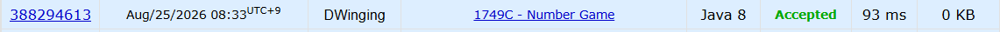

### Codeforces 1749C [Number Game](https://codeforces.com/problemset/problem/1749/C) (Java)

> **날짜:** 2026년 8월 25일 <br>
> **알고리즘:** 그리디, 이분 탐색, 두 포인터 <br>
> **언어:**  Java <br>
> **핵심 키워드:** 그리디, 이분 탐색, 두 포인터, 게임 이론

## 📌 문제 개요

* 양의 정수로 이루어진 크기 `n`의 배열이 주어진다.

* Alice는 게임 시작 전에 `k`를 정하고, 총 `k`번의 턴을 진행한다.

* `i`번째 턴에서 Alice는 `k - i + 1` 이하의 값 하나를 제거해야 한다.

* 이후 배열이 비어 있지 않다면 Bob은 남은 원소 하나에 `k - i + 1`을 더한다.

* Alice가 어떤 턴에서 조건을 만족하는 값을 제거하지 못하면 패배한다.

* Alice와 Bob이 모두 최적으로 플레이할 때, Alice가 이길 수 있는 `k`의 최댓값을 구한다.

---

## 💡 풀이 핵심 (Core Logic)

### 1. `k`를 정한 뒤 승리 가능 여부 판별

특정 `k`에 대해 Alice가 모든 턴을 정상적으로 진행할 수 있는지 확인한다.

Alice가 `k`로 승리할 수 있다면 더 큰 `k`를 확인하고, 승리할 수 없다면 더 작은 `k`를 확인한다.

이를 통해 가능한 `k`의 최댓값을 찾는다.

---

### 2. 배열 정렬 후 두 포인터 활용

배열을 오름차순으로 정렬한다.

```text
left  -> 가장 작은 남은 값
right -> 가장 큰 남은 값
```

Alice와 Bob의 최적 선택은 정렬된 배열의 양쪽 끝을 이용해 처리할 수 있다.

---

### 3. Alice는 조건을 만족하는 가장 큰 값 제거

현재 턴의 기준값을 `t`라고 하면 Alice는 다음 조건을 만족하는 값 중 가장 큰 값을 제거한다.

```text
arr[right] <= t
```

큰 값부터 제거해야 이후 더 작은 기준값에서도 선택 가능한 값을 최대한 남길 수 있다.

조건을 만족하는 값이 없다면 해당 `k`로는 승리할 수 없다.

---

### 4. Bob이 증가시킨 값은 이후 선택 불가능

Bob은 남은 원소 하나에 현재 기준값 `t`를 더한다.

모든 원소가 양수이므로 증가된 값은 최소 다음과 같다.

```text
arr[i] + t > t
```

이후 Alice의 기준값은 `t - 1`, `t - 2`, ... 로 계속 감소하므로 Bob이 증가시킨 원소는 다시 Alice가 선택할 수 없다.

따라서 실제 값을 변경할 필요 없이, Bob이 선택한 원소를 배열에서 제거한 것처럼 처리할 수 있다.

Bob은 Alice에게 최대한 불리하도록 가장 작은 값을 제거하므로 `left` 포인터를 한 칸 이동시킨다.

---

### 5. 최대 `k` 탐색

`k`가 작을수록 Alice가 승리하기 쉽고, 특정 `k`에서 승리할 수 없다면 그보다 큰 `k`에서도 승리할 수 없다.

따라서 승리 가능 여부를 기준으로 이분 탐색하여 최대 `k`를 구한다.

```text
승리 가능 -> k 증가
승리 불가능 -> k 감소
```

결국 전체 구조는 다음과 같다.

```text
정렬
→ k에 대한 승리 가능 여부 판별
→ 두 포인터로 게임 진행
→ 이분 탐색으로 최대 k 계산
```

---

## 🧠 회고 및 결론
 
게임 이론 문제다. n의 범위가 1 ~ 100으로 작은 편이지만, 다양한 알고리즘을 적용할 수 있어서 재밌는 문제였다.

---

### 📂 소스 코드
*   [Solution.java](./Solution.java)
 
---

### 🖥️ 실행 결과



---