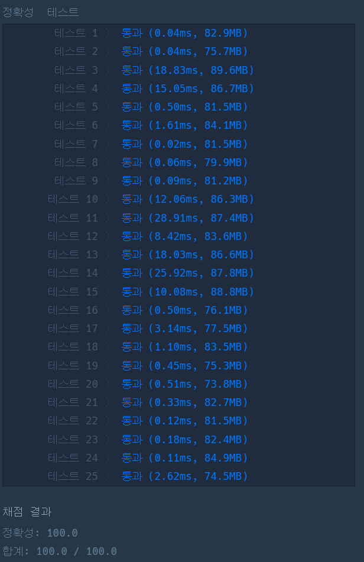

### 프로그래머스 Lv3 [외벽 점검](https://school.programmers.co.kr/learn/courses/30/lessons/60062) (Java)

> **날짜:** 2026년 8월 26일 <br>
> **알고리즘:** 그리디, 백트래킹 <br>
> **언어:**  Java <br>
> **핵심 키워드:** 그리디, 백트래킹, 원형 배열 선형화

**## 📌 문제 개요**

* 원형 외벽에는 여러 개의 취약 지점이 존재한다.
* 각 친구는 1시간 동안 이동할 수 있는 거리가 서로 다르다.
* 친구는 한 지점에서 출발해 시계 방향 또는 반시계 방향으로 이동하며 취약 지점을 점검할 수 있다.
* 모든 취약 지점을 점검하기 위해 필요한 친구 수의 최솟값을 구한다.
* 모든 친구를 투입해도 점검할 수 없는 경우 `-1`을 반환한다.

**---**

**## 💡 풀이 핵심 (Core Logic)**

**### 1. 탐색 기준을 취약점이 아닌 친구로 설정**

취약점의 개수는 최대 `15`, 친구의 수는 최대 `8`이다.

취약점을 직접 상태로 관리하면 원형 구조와 연속된 점검 범위를 함께 고려해야 하므로 상태가 복잡해진다.

반면 친구를 기준으로 탐색하면, 현재 위치에서 어떤 친구를 투입할지만 결정하면 되므로 백트래킹 구조로 단순화할 수 있다.

**---**

**### 2. 원형 외벽을 선형 배열로 변환**

원형 구조를 그대로 처리하면 배열의 끝과 시작을 연결하는 별도의 처리가 필요하다.

이를 단순화하기 위해 `weak` 배열을 두 배로 확장한다.

```text
기존 위치       : weak[i]
한 바퀴 뒤 위치 : weak[i] + n
```

예를 들어 다음과 같은 취약점이 있다면,

```text
[1, 5, 6, 10]
```

확장된 배열은 다음과 같다.

```text
[1, 5, 6, 10, 13, 17, 18, 22]
```

이후 각 취약점을 시작점으로 설정하여 원형 문제를 선형 구간 문제처럼 처리한다.

**---**

**### 3. 친구의 투입 순서를 백트래킹으로 탐색**

현재까지 점검하지 않은 첫 취약점에 아직 사용하지 않은 친구 한 명을 배치한다.

```text
친구 선택
→ 해당 친구가 점검 가능한 범위 계산
→ 남은 첫 취약점부터 다음 친구 선택
```

친구의 수는 최대 `8`명이므로 모든 투입 순서를 탐색해도 최대 `8!` 수준으로 처리할 수 있다.

이미 사용한 친구는 `visited` 배열로 관리한다.

**---**

**### 4. 선택한 친구는 가능한 취약점을 모두 점검**

친구를 한 명 선택한 이후에는 이동 가능한 범위 안의 취약점을 모두 점검하는 것이 항상 유리하다.

따라서 현재 취약점에서 시작해 이동 거리 안에 포함되는 다음 취약점을 연속해서 제거한다.

```text
현재 친구 선택

→ 시작 취약점 점검

→ 이동 가능한 동안 다음 취약점 점검

→ 점검하지 않은 첫 취약점부터 재귀 탐색
```

이 과정은 별도의 선택이 필요하지 않으므로 그리디하게 처리할 수 있다.

**---**

**### 5. 가지치기를 통해 불필요한 탐색 제거**

다음 경우에는 더 이상 탐색하지 않는다.

```text
모든 취약점을 점검한 경우
→ 사용한 친구 수로 최솟값 갱신

모든 친구를 사용한 경우
→ 탐색 종료

현재 사용한 친구 수가 이미 구한 최솟값 이상인 경우
→ 탐색 종료
```

결국 전체 구조는 다음과 같다.

```text
원형 외벽을 선형 배열로 변환

→ 각 취약점을 시작점으로 설정

→ 친구 투입 순서를 백트래킹으로 탐색

→ 선택한 친구는 이동 가능한 취약점을 최대한 점검

→ 최소 친구 수 갱신
```

**핵심은 탐색의 기준을 취약점이 아닌 친구로 설정하는 것이다.**

---

## 🧠 회고 및 결론

원형, 연속 구간, 취약점과 친구 라는 키워드에서 누적합과 두 포인터, 원형 DP, 비트마스킹을 활용한 DP 완전 탐색, 백트래킹 등의 발상을 떠올렸다. 

누적합과 각 취약점 사이의 거리를 미리 구하고, 두 포인터로 필요한 구간을 채우는 발상을 먼저 해봤다. 하지만 이 경우 모든 취약점 마다 보낼 친구를 계속해서 탐색해야하고, 해당 값이 정답이라는 보장이 없었다.

그 다음은 이전에 단어 퍼즐에서 사용했었던 DP 방식을 적용해보려고 했다. 특정 취약점에서 출발해서 어디 범위까지 커버할 수 있는지 판단하고, 거리를 연결해볼 생각이었다. 하지만 이 경우 역시, 중간에 매 구간 어떤 친구를 보냈는지를 함께 관리해야해서 어렵다고 판단했다.

문제에 주어진 조건을 보면서 백트래킹으로 접근을 하게 되었다. 취약점이 최대 15개, 친구가 최대 8명이라는 부분에서 비트마스킹을 활용한 DP 방식이나 백트래킹이 가능하다고 생각했다. 만약에 백트래킹을 적용한다면, 취약점과 친구 중 어떤 값을 기준으로 탐색할지 판단할 필요가 있었다. 

고민 끝에 백트래킹을 선택했고, 친구를 기준으로 탐색을 진행했다. 친구를 기준으로 탐색한 이유는 다음과 같다.
1. 친구의 수가 최대 8이다.
2. 보낼 친구의 수를 최소로 구해야한다.
3. 친구를 기준으로 연속된 구간을 한번에 구할 수 있다.

시작점은 취약점을 기준으로 설정했지만, 실제 백트래킹의 탐색 대상은 친구로 설정했다.

취약점을 기준으로 탐색할 경우 각 구간을 어떤 친구가 담당했는지까지 함께 관리해야 했지만, 친구를 기준으로 탐색하면 현재 친구가 처리할 수 있는 연속 구간을 한 번에 제거할 수 있었다.

결국 이 문제는 단순히 작은 제한을 찾는 것보다, 어떤 값을 탐색의 기준으로 설정할 것인지 판단하는 것이 핵심이었다.

---

### 📂 소스 코드
*   [Solution.java](./Solution.java)
 
---

### 🖥️ 실행 결과



---