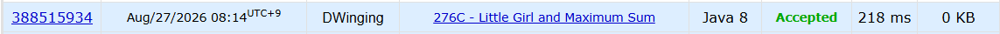

### Codeforces 276C [Little Girl and Maximum Sum](https://codeforces.com/problemset/problem/276/C) (Java)

> **날짜:** 2026년 8월 27일 <br>
> **알고리즘:** 차분 배열 트릭, 그리디, 누적 합, 정렬 <br>
> **언어:**  Java <br>
> **핵심 키워드:** 차분 배열 트릭, 그리디, 누적 합, 정렬

## 📌 문제 개요

* 길이 `n`의 배열과 `q`개의 구간 쿼리가 주어진다.
* 각 쿼리는 `[l, r]` 범위의 원소 합을 계산한다.
* 쿼리를 처리하기 전에 배열의 원소 순서를 자유롭게 변경할 수 있다.
* 모든 쿼리 결과의 합이 최대가 되도록 배열을 재배치하고, 그 최댓값을 구한다.

---

## 💡 풀이 핵심 (Core Logic)

### 1. 각 인덱스의 등장 횟수를 계산

전체 결과는 각 배열 원소가 쿼리에 포함되는 횟수만큼 반복해서 더해지는 구조이다.

따라서 각 인덱스가 전체 쿼리에서 몇 번 사용되는지를 계산하는 것이 핵심이다.

구간마다 직접 모든 위치를 증가시키면 `O(nq)`가 필요하므로 차분 배열을 사용한다.

```text
[l, r]

diff[l] += 1
diff[r + 1] -= 1
```

이후 누적합을 계산하면 각 인덱스가 쿼리에 포함된 횟수를 구할 수 있다.

---

### 2. 사용 횟수가 많은 위치에 큰 값을 배치

어떤 위치가 `k`번 사용된다면 해당 위치의 값은 최종 합에 `k`번 반영된다.

따라서 전체 합을 최대화하려면

```text
큰 배열 값 ↔ 높은 사용 횟수
작은 배열 값 ↔ 낮은 사용 횟수
```

가 되도록 배치해야 한다.

배열 값과 각 인덱스의 사용 횟수를 각각 정렬한 뒤 같은 순서끼리 곱한다.

---

### 3. 최종 합 계산

```text
정렬된 배열 값 × 정렬된 사용 횟수
```

를 모든 인덱스에 대해 더하면 최대값을 얻을 수 있다.

```text
차분 배열로 구간 카운팅
→ 누적합으로 인덱스별 사용 횟수 계산
→ 배열 값과 사용 횟수 정렬
→ 큰 값끼리 대응하여 합 계산
```

**핵심은 여러 쿼리가 중복되는 범위를 인덱스별 사용 횟수로 변환하는 것이다.**

---

## 🧠 회고 및 결론
 
각 인덱스가 쿼리에 포함되는 횟수와 숫자를 매칭하는 것이 핵심 키워드였다. 각 인덱스가 쿼리에 포함되는 횟수는 차분 배열 트릭을 활용하면 간단하게 구할 수 있다.

---

### 📂 소스 코드
*   [Solution.java](./Solution.java)
 
---

### 🖥️ 실행 결과



---