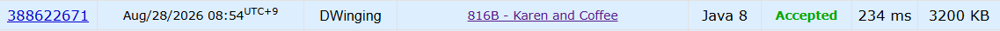

### Codeforces 816B [Karen and Coffee](https://codeforces.com/problemset/problem/816/B) (Java)

> **날짜:** 2026년 8월 28일 <br>
> **알고리즘:** 차분 배열 트릭, 누적 합<br>
> **언어:**  Java <br>
> **핵심 키워드:** 차분 배열 트릭, 누적 합

## 📌 문제 개요

* `n`개의 커피 레시피가 주어진다.
* 각 레시피는 커피를 만들기 적절한 온도 구간 `[l, r]`을 가진다.
* 어떤 온도가 최소 `k`개의 레시피에 포함되면 해당 온도를 **허용 가능한 온도(admissible)** 로 판단한다.
* `q`개의 질의 `[a, b]`에 대해, 해당 범위 안에 존재하는 허용 가능한 정수 온도의 개수를 구한다.

---

## 💡 풀이 핵심 (Core Logic)

### 1. 차분 배열로 온도별 추천 횟수 계산

각 레시피의 구간 `[l, r]`에 포함되는 모든 온도를 직접 증가시키면 비효율적이다.

따라서 차분 배열을 사용한다.

```text
diff[l] += 1
diff[r + 1] -= 1
```

이후 누적합을 계산하면 각 온도가 몇 개의 레시피에 포함되는지 구할 수 있다.

---

### 2. 허용 가능한 온도를 0/1로 변환

각 온도에 대해 추천 횟수가 `k` 이상이면 `1`, 아니면 `0`으로 변환한다.

```text
recommend[i] >= k → 1
recommend[i] < k  → 0
```

이 값은 해당 온도가 허용 가능한지 여부를 의미한다.

---

### 3. 질의 처리를 위한 누적합 생성

허용 가능한 온도 여부를 나타내는 0/1 배열에 다시 누적합을 적용한다.

```text
prefix[i]
= 1번 온도부터 i번 온도까지
  허용 가능한 온도의 개수
```

그러면 각 질의 `[a, b]`는 다음과 같이 `O(1)`에 처리할 수 있다.

```text
prefix[b] - prefix[a - 1]
```

---

```text
차분 배열로 레시피 구간 반영
→ 누적합으로 온도별 추천 횟수 계산
→ k 이상인 온도를 0/1로 변환
→ 다시 누적합
→ 각 구간 질의를 O(1)에 처리
```

**핵심은 구간 중첩 횟수를 한 번 계산한 뒤, 조건을 만족하는 온도를 다시 누적합으로 전처리하는 것이다.**

---

## 🧠 회고 및 결론

누적 합은 중복 연산을 줄이는 것이 핵심이다. 누적 합 알고리즘은 아직 어렵다.

---

### 📂 소스 코드
*   [Solution.java](./Solution.java)
 
---

### 🖥️ 실행 결과



---