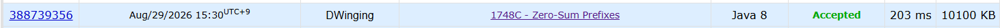

### Codeforces 1600 [Zero-Sum prefixes](https://codeforces.com/problemset/problem/1748/C) (Java)

> **날짜:** 2026년 8월 29일 <br>
> **알고리즘:** 누적 합, 자료구조, DP, 그리디<br>
> **언어:**  Java <br>
> **핵심 키워드:** 누적 합, 빈도 수 카운팅, 그리디

## 📌 문제 개요

* 배열 `a`가 주어지고, 누적합이 `0`이 되는 위치의 개수를 **score**라고 한다.
* 값이 `0`인 원소는 원하는 정수로 변경할 수 있다.
* `0`인 원소들을 적절히 변경하여, 누적합이 `0`이 되는 위치의 최대 개수를 구한다.

---

## 💡 풀이 핵심 (Core Logic)

### 1. 첫 번째 `0` 이전은 누적합이 실제로 `0`인 경우만 카운트

첫 번째 `0`을 만나기 전에는 값을 변경할 수 없기 때문에 누적합을 그대로 계산한다.

```text
prefixSum == 0
→ score 증가
```

---

### 2. `0`을 기준으로 구간을 나눈다

원소가 `0`인 위치에서는 값을 자유롭게 변경할 수 있다.

따라서 각 `0`부터 다음 `0` 직전까지를 하나의 구간으로 보고 처리한다.

---

### 3. 각 구간에서 누적합의 최빈값을 선택

현재 `0`의 값을 조절하면 이후 구간의 누적합 전체에 동일한 값을 더하거나 뺄 수 있다.

따라서 구간 내에서 **가장 많이 등장한 누적합 값**을 `0`으로 만들도록 조정하는 것이 최적이다.

`HashMap`을 사용해 각 누적합의 등장 횟수를 저장하고 최댓값을 구한다.

```text
0 기준으로 구간 분리
→ 구간별 누적합 빈도 계산
→ 가장 많이 등장한 누적합의 빈도를 정답에 추가
```

**핵심은 `0`을 기준으로 구간을 나누고, 각 구간에서 누적합의 최빈값을 선택하는 것이다.**

---

## 🧠 회고 및 결론
 
누적 합과 DP, 그리디 발상이 필요한 문제였다. 생각보다 발상 난이도가 있었던 문제로 GPT의 도움을 받아 문제를 해결할 수 있었다.

이번 문제를 통해 코드포스 난이도 기준점을 잡을 수 있었다. 1300 ~ 1400점 구간은 가볍게 푸는 구간, 1500은 무난한 구간, 1600 ~ 1700은 알고리즘의 영향을 받는 구간으로 생각이 필요하다. 즉 내 수준은 1500정도이고, 1600 ~ 1700 구간도 충분히 도전 가능한 것 같다.

---

### 📂 소스 코드
*   [Solution.java](./Solution.java)
 
---

### 🖥️ 실행 결과



---