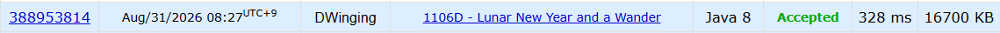

### Codeforces 1106D [Lunar New Year and a Wander](https://codeforces.com/problemset/problem/1106/D) (Java)

> **날짜:** 2026년 8월 31일 <br>
> **알고리즘:** 그래프 탐색, 자료구조 <br>
> **언어:**  Java <br>
> **핵심 키워드:** 그래프 탐색, 자료구조

## 📌 문제 개요

* `n`개의 정점과 `m`개의 양방향 간선으로 이루어진 연결 그래프가 주어진다.
* Bob은 `1`번 정점에서 시작하며, 처음 방문한 정점의 번호를 순서대로 기록한다.
* 이미 방문한 정점은 다시 지나갈 수 있지만, 노트에는 각 정점이 처음 방문되었을 때만 기록된다.
* 모든 정점을 방문했을 때 기록된 정점 순서 중 **사전순으로 가장 작은 순서**를 구한다.

---

## 💡 풀이 핵심 (Core Logic)

### 1. 현재 방문 가능한 정점들을 후보로 관리한다

이미 방문한 정점들은 자유롭게 다시 이동할 수 있으므로, 현재 위치 하나만을 기준으로 다음 정점을 결정할 필요가 없다.

지금까지 방문한 모든 정점과 연결되어 있는 미방문 정점들은 모두 다음 방문 후보가 될 수 있다.

```text
방문한 정점 집합
→ 연결된 미방문 정점 확인
→ 다음 방문 후보로 추가
```

---

### 2. 사전순 최소를 위해 가장 작은 번호의 정점을 선택한다

기록되는 순서를 사전순으로 최소화하려면, 현재 방문 가능한 후보 중 가장 작은 번호의 정점을 항상 먼저 선택해야 한다.

따라서 후보 정점들을 우선순위 큐에 저장하면 가장 작은 번호의 정점을 효율적으로 선택할 수 있다.

```text
방문 가능한 후보 정점
→ 우선순위 큐에 저장
→ 가장 작은 번호의 정점 선택
```

---

### 3. 새로운 정점을 방문할 때 후보를 확장한다

우선순위 큐에서 하나의 정점을 꺼내 방문한 뒤, 해당 정점과 연결된 미방문 정점들을 새로운 후보로 추가한다.

이 과정을 반복하면 현재까지 방문한 영역과 연결된 모든 후보를 지속적으로 관리할 수 있다.

```text
현재 후보 중 최소 번호 선택
→ 해당 정점 방문
→ 인접한 미방문 정점을 후보에 추가
```

---

### 4. 후보에 추가하는 시점에 방문 처리한다

그래프에는 중복 간선과 자기 자신을 연결하는 간선이 존재할 수 있다.

같은 정점이 우선순위 큐에 여러 번 삽입되는 것을 방지하기 위해, 정점을 큐에 추가하는 시점에 방문 처리를 수행한다.

```text
미방문 정점 발견
→ 우선순위 큐에 추가
→ 즉시 방문 처리
```

이를 통해 각 정점은 우선순위 큐에 최대 한 번만 삽입된다.

---

**핵심은 현재까지 방문한 정점들로부터 접근 가능한 후보들을 우선순위 큐로 관리하고, 그중 가장 작은 번호의 정점을 반복적으로 선택하여 사전순으로 가장 작은 방문 순서를 구성하는 것이다.**

---


## 🧠 회고 및 결론
 
방문 가능한 노드의 후보를 관리해야 한다는 점이 흥미로운 문제였다.

중복 탐색이 가능하다는 점을 활용해 백트래킹 형태의 DFS로도 구성할 수 있지만, BFS에 우선순위큐를 사용하는 것이 깔끔하다. 다른 방식으로는 MST의 프림 알고리즘을 응용할 수 있다.

---

### 📂 소스 코드
*   [Solution.java](./Solution.java)
 
---

### 🖥️ 실행 결과



---