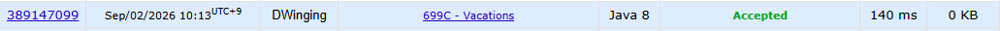

### Codeforces 699C [Vacations](https://codeforces.com/problemset/problem/699/C) (Java)

> **날짜:** 2026년 9월 2일 <br>
> **알고리즘:** DP <br>
> **언어:**  Java <br>
> **핵심 키워드:** DP

## 📌 문제 개요

* Vasya는 `n`일 동안 휴가를 보내며, 각 날짜마다 다음 세 가지 행동 중 하나를 선택할 수 있다.

```text
휴식
대회 참가
운동
```

* 각 날짜에는 체육관 운영 여부와 대회 개최 여부가 주어지며, 이를 `0 ~ 3`의 값으로 표현한다.

```text
0 : 대회 X, 운동 X
1 : 대회 O, 운동 X
2 : 대회 X, 운동 O
3 : 대회 O, 운동 O
```

* 단, 같은 활동을 이틀 연속으로 수행할 수 없다.

```text
대회 → 대회 불가능
운동 → 운동 불가능
```

* 휴식은 언제든 선택할 수 있으며, 가능한 활동을 적절히 선택하여 전체 휴식 일수의 최솟값을 구해야 한다.

---

## 💡 풀이 핵심 (Core Logic)

### 1. 현재 날짜의 선택은 전날 수행한 활동에 영향을 받는다

현재 날짜에 대회 또는 운동이 가능하더라도, 전날 동일한 활동을 수행했다면 해당 활동을 선택할 수 없다.

따라서 각 날짜마다 단순히 활동 가능 여부만 확인하는 것이 아니라, **전날 어떤 활동을 했는지를 상태로 관리해야 한다.**

다음과 같이 세 가지 상태를 정의할 수 있다.

```text
dp[0][i] : i번째 날에 휴식했을 때의 최소 휴식 일수
dp[1][i] : i번째 날에 대회에 참가했을 때의 최소 휴식 일수
dp[2][i] : i번째 날에 운동했을 때의 최소 휴식 일수
```

---

### 2. 휴식은 이전 상태와 관계없이 선택할 수 있다

현재 날짜에 휴식을 선택하는 경우 전날 어떤 활동을 했는지는 중요하지 않다.

따라서 이전 날짜의 세 상태 중 최솟값에 휴식 하루를 추가한다.

```text
dp[0][i]
= min(dp[0][i - 1],
      dp[1][i - 1],
      dp[2][i - 1]) + 1
```

휴식을 선택하면 휴식 일수가 증가하므로 `+1`을 적용한다.

---

### 3. 대회와 운동은 동일한 활동이 연속되지 않도록 이전 상태를 제한한다

현재 날짜에 대회에 참가하려면 해당 날짜에 대회가 개최되어 있어야 하며, 전날에는 대회에 참가하지 않았어야 한다.

따라서 이전 상태는 휴식 또는 운동만 가능하다.

```text
dp[1][i]
= min(dp[0][i - 1],
      dp[2][i - 1])
```

마찬가지로 현재 날짜에 운동하려면 체육관이 열려 있어야 하며, 전날에는 운동하지 않았어야 한다.

```text
dp[2][i]
= min(dp[0][i - 1],
      dp[1][i - 1])
```

---

### 4. 각 날짜의 활동 가능 여부에 따라 필요한 상태만 갱신한다

입력값 `a[i]`에 따라 현재 날짜에 수행 가능한 활동이 달라진다.

```text
a[i] = 0
→ 휴식만 가능

a[i] = 1
→ 휴식 또는 대회

a[i] = 2
→ 휴식 또는 운동

a[i] = 3
→ 휴식, 대회, 운동 모두 가능
```

따라서 각 날짜에서 가능한 상태만 전이시키고, 불가능한 상태는 충분히 큰 값으로 유지한다.

---

### 5. 마지막 날짜의 세 상태 중 최솟값이 정답이다

마지막 날에는 휴식, 대회, 운동 중 어떤 상태로 끝나더라도 상관없다.

따라서 마지막 날짜의 세 상태 중 가장 작은 값을 선택한다.

```text
answer
= min(dp[0][n - 1],
      dp[1][n - 1],
      dp[2][n - 1])
```

각 날짜마다 세 개의 상태만 확인하므로 시간 복잡도는 `O(n)`이다.

---

**핵심은 전날 수행한 활동을 DP 상태로 관리하여 동일한 활동의 연속 선택을 방지하고, 각 날짜의 활동 가능 여부에 따라 가능한 상태만 전이시키는 것이다.**

---

## 🧠 회고 및 결론

3가지 일정에 대한 상태 관리 문제다. DP 공부할 때 자주 접하게 되는 유형이라 익숙한 문제였다.

---

### 📂 소스 코드
*   [Solution.java](./Solution.java)
 
---

### 🖥️ 실행 결과



---