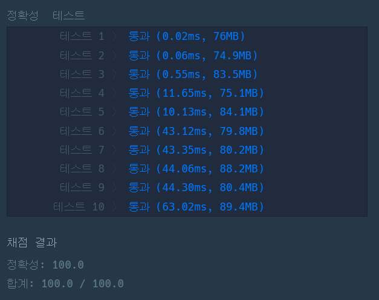

### 프로그래머스 Lv3 [고고학 최고의 발견](https://school.programmers.co.kr/learn/courses/30/lessons/131702) (Java)

> **날짜:** 2026년 9월 3일 <br>
> **알고리즘:** 백트래킹, 브루트포스, 그리디<br>
> **언어:**  Java <br>
> **핵심 키워드:** 백트래킹, 브루트포스, 그리디

## 📌 문제 개요

* `N x N` 크기의 시계판이 주어지며, 각 시계는 `0 ~ 3`의 값으로 현재 방향을 나타낸다.

```text
0 : 12시
1 : 3시
2 : 6시
3 : 9시
```

* 하나의 시계를 한 번 회전시키면 해당 시계와 상하좌우에 인접한 시계가 모두 시계 방향으로 `90도` 회전한다.

```text
      ↑
← 현재 →
      ↓
```

* 각 시계는 여러 번 회전시킬 수 있으며, 네 번 회전하면 다시 원래 상태로 돌아온다.
* 모든 시계가 `0`, 즉 12시 방향을 가리키도록 만들기 위한 최소 조작 횟수를 구해야 한다.
* `N`의 크기는 최대 `8`이므로 모든 칸의 회전 횟수를 직접 탐색할 수는 없지만, 첫 번째 행의 경우의 수만 탐색하는 것은 가능하다.

---

## 💡 풀이 핵심 (Core Logic)

### 1. 각 시계의 회전 횟수는 0 ~ 3번만 고려하면 된다

하나의 시계를 네 번 회전시키면 해당 시계와 인접한 시계들이 모두 원래 상태로 돌아온다.

따라서 특정 시계를 네 번 이상 회전시키는 경우는 최소 조작 횟수에 포함될 필요가 없다.

각 시계에서 고려해야 하는 회전 횟수는 다음 네 가지이다.

```text
0번
1번
2번
3번
```

---

### 2. 첫 번째 행의 회전 횟수를 모두 탐색한다

첫 번째 행은 위쪽에서 영향을 줄 수 있는 시계가 존재하지 않는다.

또한 한 시계의 상태는 자기 자신뿐만 아니라 좌우와 아래쪽 시계의 회전에도 영향을 받는다.

따라서 첫 번째 행의 특정 시계를 몇 번 회전시킬지만 독립적으로 결정할 수 없으며, **첫 번째 행 전체의 회전 조합을 고려해야 한다.**

첫 번째 행의 각 칸에 대해 다음 네 가지 선택을 수행한다.

```text
0번 회전
1번 회전
2번 회전
3번 회전
```

각 선택을 실제 시계판에 반영한 뒤 다음 칸을 탐색하고, 탐색이 끝나면 적용했던 회전을 되돌려 이전 상태를 복구한다.

이를 통해 첫 번째 행에서 가능한 모든 회전 상태를 탐색한다.

---

### 3. 첫 번째 행이 결정되면 이후 행의 회전 횟수는 강제로 결정된다

첫 번째 행의 회전이 모두 결정된 이후에는 두 번째 행부터 순차적으로 시계를 맞춘다.

현재 `y`번째 행을 처리할 때는 바로 위쪽인 `y - 1`번째 행의 값을 확인한다.

```text
arr[y - 1][x] = 0
→ 현재 위치를 회전할 필요 없음

arr[y - 1][x] = 1
→ 현재 위치를 3번 회전

arr[y - 1][x] = 2
→ 현재 위치를 2번 회전

arr[y - 1][x] = 3
→ 현재 위치를 1번 회전
```

즉, 위쪽 시계의 현재 값이 `v`라면 현재 위치를 다음 횟수만큼 회전시킨다.

```text
4 - v
```

현재 행보다 아래쪽의 시계만 이후에 추가로 조작할 수 있으므로, 위쪽 행을 수정할 수 있는 마지막 위치는 현재 위치이다.

따라서 첫 번째 행이 결정된 이후에는 각 위치의 회전 횟수를 별도로 선택할 필요가 없다.

---

### 4. 위쪽 행부터 순차적으로 0으로 고정한다

두 번째 행부터 마지막 행까지 순차적으로 진행하면서 바로 위의 시계를 `0`으로 만든다.

```text
1행의 조작 → 0행을 확정

2행의 조작 → 1행을 확정

3행의 조작 → 2행을 확정
```

한 번 확정된 행은 이후의 조작으로 다시 변경되지 않는다.

따라서 위에서 아래 방향으로 순차적으로 처리하면서 각 행을 확정할 수 있다.

---

### 5. 마지막 행이 모두 0인지 확인한다

마지막 행까지 도달하면 더 아래쪽에서 회전시킬 시계가 존재하지 않는다.

따라서 마지막 행의 값은 더 이상 변경할 수 없다.

```text
마지막 행의 모든 값이 0
→ 현재 첫 번째 행의 선택으로 퍼즐 해결 가능

하나라도 0이 아님
→ 현재 경우로는 퍼즐 해결 불가능
```

퍼즐을 해결할 수 있는 경우에는 첫 번째 행에서 사용한 회전 횟수와 이후 행에서 사용한 회전 횟수를 모두 더해 최소 조작 횟수를 갱신한다.

---

### 6. 현재 조작 횟수가 기존 최솟값을 초과하면 탐색을 종료한다

첫 번째 행의 경우를 탐색하는 과정에서 현재까지 사용한 조작 횟수가 이미 기존 최소 조작 횟수보다 크다면, 이후에 어떤 선택을 하더라도 더 작은 값을 만들 수 없다.

따라서 해당 경우는 더 이상 탐색하지 않고 종료할 수 있다.

---

**핵심은 첫 번째 행의 회전 조합만 모두 탐색한 뒤, 이후 행에서는 바로 위쪽 시계를 0으로 만들기 위한 회전 횟수를 순차적으로 결정하는 것이다.**

---


## 🧠 회고 및 결론
 
생각보다 까다로운 문제였다. 이전에 비트마스킹을 활용한 같은 유형의 문제를 풀어본 경험이 있었는데, 당시에는 각 칸의 상태가 0과 1 두 가지뿐이라 첫 행을 비트마스킹으로 탐색할 수 있었다.

이번 문제 역시 첫 행의 모든 경우를 탐색한 뒤, 이후 행은 바로 위의 값을 맞추도록 회전 횟수를 결정하고 마지막 행이 모두 0인지 확인하는 구조는 동일했다. 다만 각 칸마다 0~3번의 회전을 고려해야 하므로 첫 행의 경우의 수가 4^N으로 늘어났고, 상태 변경과 복구까지 함께 관리해야 해서 구현 과정에서 설계를 여러 번 수정했다.

---

### 📂 소스 코드
*   [Solution.java](./Solution.java)
 
---

### 🖥️ 실행 결과



---