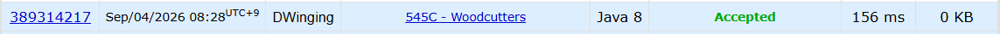

### Codeforces 545C [Woodcutters](https://codeforces.com/problemset/problem/545/C) (Java)

> **날짜:** 2026년 9월 4일 <br>
> **알고리즘:** 그리디 <br>
> **언어:**  Java <br>
> **핵심 키워드:** 그리디

## 📌 문제 개요

* 도로 위에 `n`그루의 나무가 서로 다른 좌표 `x_i`에 배치되어 있으며, 각 나무의 높이는 `h_i`이다.

* 각 나무는 다음 세 가지 상태 중 하나를 가질 수 있다.

```text
왼쪽으로 쓰러뜨리기
오른쪽으로 쓰러뜨리기
쓰러뜨리지 않기
```

* `i`번째 나무를 왼쪽으로 쓰러뜨리면 `[x_i - h_i, x_i]` 구간을 차지하고, 오른쪽으로 쓰러뜨리면 `[x_i, x_i + h_i]` 구간을 차지한다.

* 나무를 쓰러뜨렸을 때 차지하는 구간 안에 다른 나무 또는 이미 쓰러진 나무가 차지한 지점이 존재하면 해당 방향으로는 쓰러뜨릴 수 없다.

* 나무들은 좌표 기준 오름차순으로 주어지며, 서로 겹치지 않도록 가능한 한 많은 나무를 쓰러뜨렸을 때의 최대 개수를 구해야 한다.

---

## 💡 풀이 핵심 (Core Logic)

### 1. 나무를 왼쪽부터 순차적으로 처리한다

나무의 좌표가 오름차순으로 주어지므로 왼쪽 나무부터 순차적으로 상태를 결정한다.

현재 나무를 처리할 때 이미 결정이 끝난 왼쪽 영역만 고려하면 되며, 이후 나무의 상태를 미리 결정할 필요는 없다.

따라서 각 나무에 대해 다음 순서로 판단한다.

```text
왼쪽으로 쓰러뜨릴 수 있는가?
→ 가능하면 왼쪽으로 쓰러뜨린다.

왼쪽으로 쓰러뜨릴 수 없는가?
→ 오른쪽으로 쓰러뜨릴 수 있는지 확인한다.

둘 다 불가능한가?
→ 현재 나무를 세워 둔다.
```

---

### 2. 왼쪽으로 쓰러뜨릴 수 있다면 항상 왼쪽을 선택한다

현재 나무를 왼쪽으로 쓰러뜨릴 수 있는 조건은 다음과 같다.

```text
x_i - h_i > 이전에 점유된 가장 오른쪽 위치
```

왼쪽으로 쓰러뜨리는 경우 현재 나무의 오른쪽 공간을 추가로 사용하지 않는다.

따라서 현재 나무를 왼쪽으로 쓰러뜨리는 선택은 이후 나무가 사용할 수 있는 공간을 줄이지 않으며, 가능한 선택 중 가장 안전한 선택이다.

즉, 왼쪽으로 쓰러뜨릴 수 있는 경우에는 다른 선택을 고려할 필요 없이 바로 쓰러뜨릴 수 있다.

---

### 3. 왼쪽이 불가능하면 오른쪽으로 쓰러뜨릴 수 있는지 확인한다

현재 나무를 왼쪽으로 쓰러뜨릴 수 없다면 오른쪽 방향을 확인한다.

현재 나무를 오른쪽으로 쓰러뜨릴 수 있는 조건은 다음과 같다.

```text
x_i + h_i < x_{i+1}
```

현재 나무가 오른쪽으로 쓰러지면 다음 나무의 왼쪽 방향 선택을 제한할 수 있다.

그러나 이를 이유로 현재 나무를 세워 둘 필요는 없다.

현재 나무를 오른쪽으로 쓰러뜨리면 확정적으로 나무 한 그루를 처리할 수 있다.

반대로 현재 나무를 세워 두고 다음 나무가 왼쪽으로 쓰러지기를 기대하더라도 처리되는 나무의 수는 동일하게 한 그루이며, 다음 나무가 실제로 왼쪽으로 쓰러질 수 있다는 보장도 없다.

따라서 현재 나무를 오른쪽으로 쓰러뜨릴 수 있다면 즉시 쓰러뜨리는 것이 항상 손해가 없는 선택이다.

---

### 4. 오른쪽으로 쓰러뜨린 경우 점유 범위를 갱신한다

현재 나무를 왼쪽으로 쓰러뜨리거나 세워 둔 경우, 오른쪽 기준 점유 위치는 기존 좌표 `x_i`이다.

반면 오른쪽으로 쓰러뜨리면 `[x_i, x_i + h_i]` 구간을 차지하므로 다음 나무를 판단할 때 기준이 되는 위치가 달라진다.

따라서 오른쪽으로 쓰러뜨린 경우에는 현재 나무의 위치를 다음과 같이 갱신한다.

```text
x_i = x_i + h_i
```

이 값을 이후 나무가 왼쪽으로 쓰러질 수 있는지 판단하는 기준으로 사용한다.

---

### 5. 첫 번째와 마지막 나무는 항상 쓰러뜨릴 수 있다

첫 번째 나무의 왼쪽에는 다른 나무가 존재하지 않으므로 항상 왼쪽으로 쓰러뜨릴 수 있다.

마지막 나무의 오른쪽에도 다른 나무가 존재하지 않으므로 항상 오른쪽으로 쓰러뜨릴 수 있다.

따라서 `n >= 2`인 경우 첫 번째와 마지막 나무는 미리 처리된 것으로 간주하고, 중간 나무에 대해서만 그리디 판단을 수행할 수 있다.

단, `n = 1`인 경우에는 나무가 한 그루뿐이므로 정답은 `1`이다.

---

### 6. 현재 선택만으로 최적해를 유지할 수 있다

이 문제에서 중요한 점은 다음 나무의 상태까지 미리 고려하지 않는 것이다.

예를 들어 현재 나무를 오른쪽으로 쓰러뜨릴 수 있다고 할 때,

```text
현재 나무를 오른쪽으로 쓰러뜨림
→ 현재 나무 1개 처리

현재 나무를 세우고 다음 나무가 왼쪽으로 쓰러지기를 기다림
→ 다음 나무 1개 처리 가능
```

두 경우 모두 처리되는 나무 수는 최대 한 그루로 동일하다.

또한 다음 나무가 실제로 왼쪽으로 쓰러질 수 있다는 보장은 없다.

따라서 현재 시점에서 확정적으로 쓰러뜨릴 수 있는 나무를 처리하는 것이 최적해를 해치지 않는다.

---

**핵심은 각 나무를 왼쪽부터 순차적으로 확인하면서, 왼쪽으로 쓰러뜨릴 수 있으면 우선 왼쪽을 선택하고, 그렇지 않은 경우 오른쪽으로 쓰러뜨릴 수 있는지만 확인하는 것이다. 미래의 나무 상태를 미리 계산하지 않고 현재 가능한 선택을 확정해도 최적해를 유지할 수 있다.**

---

## 🧠 회고 및 결론

1500이라는 난이도에 비해 구현 자체는 간단한 문제였다. 결국 핵심은 현재 나무를 쓰러뜨릴 수 있다면 바로 쓰러뜨리는 선택이 최적이라는 것을 증명하는 것이다.

---

### 📂 소스 코드
*   [Solutoin.java](./Solution.java)
 
---

### 🖥️ 실행 결과



---