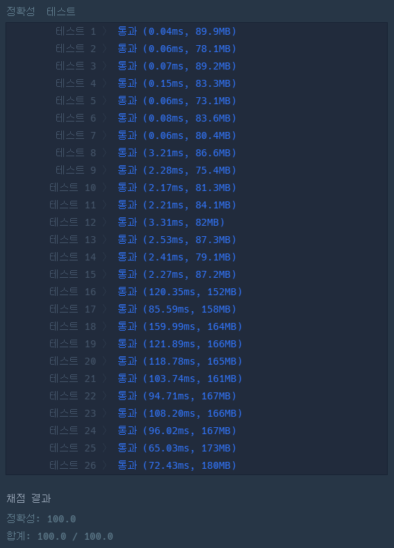

### 프로그래머스 Lv4 [트리 트리오 중간값](https://school.programmers.co.kr/learn/courses/30/lessons/68937) (Java)

> **날짜:** 2026년 9월 5일 <br>
> **알고리즘:** 트리 <br>
> **언어:**  Java <br>
> **핵심 키워드:** 트리, 트리의 지름

## 📌 문제 개요

* `n`개의 정점으로 이루어진 트리가 주어진다.

* 세 정점 `a`, `b`, `c`를 선택했을 때 다음 세 거리를 구한다.

```text
dist(a, b)
dist(b, c)
dist(c, a)
```

* 세 거리의 중간값을 `f(a, b, c)`라고 할 때, 가능한 모든 세 정점 조합 중 `f`의 최댓값을 구한다.

* 정점 수가 최대 `250,000`이므로 모든 정점 조합을 확인하는 방식은 사용할 수 없다.

---

## 💡 풀이 핵심 (Core Logic)

### 1. 트리의 지름 양 끝점을 구한다

임의의 정점에서 BFS를 수행해 가장 먼 정점 `a`를 찾는다.

이후 `a`에서 다시 BFS를 수행해 가장 먼 정점 `b`를 찾으면, `a-b`는 트리의 지름이 된다.

---

### 2. 지름의 양 끝점에서 모든 정점까지의 거리를 구한다

`a`에서 각 정점까지의 거리와 `b`에서 각 정점까지의 거리를 각각 구한다.

```text
distA[i] = dist(a, i)
distB[i] = dist(b, i)
```

---

### 3. 중간값을 계산한다.

세 번째 정점을 `c`라고 하면 비교 대상은 다음 세 거리이다.

```text
dist(a, b)
dist(a, c)
dist(b, c)
```

`dist(a, b)`는 트리의 지름이므로 트리에서 만들 수 있는 거리 중 가장 크다.

따라서 세 값의 중간값은 다음과 같다.

```text
max(dist(a, c), dist(b, c))
```

모든 정점 `c`에 대해 이 값을 확인하고 그중 최댓값을 구한다.

---

**핵심은 트리의 지름을 기준으로 두 끝점에서의 거리만 계산하면, 세 거리의 중간값을 직접 정렬하거나 모든 세 정점 조합을 탐색하지 않아도 된다는 점이다.**

---

## 🧠 회고 및 결론

트리의 지름을 활용하는 문제였다.

처음에는 최적의 세 정점에 트리 지름의 양 끝점이 포함된다고 볼 수 있는지를 판단하는 과정에서 시간이 걸렸다.

즉, 지름을 포함하지 않은 어떤 세 정점의 중앙값보다, 지름의 양 끝점과 적절한 하나의 정점을 선택했을 때의 중앙값이 항상 크거나 같다는 점​을 확인한 뒤 풀이를 확정할 수 있었다.

---

### 📂 소스 코드
*   [Solution.java](./Solution.java)
 
---

### 🖥️ 실행 결과



---