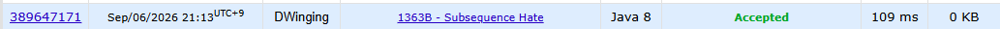

### Codeforces 1363B [Subsequence Hate](https://codeforces.com/problemset/problem/1363/B) (Java)

> **날짜:** 2026년 9월 6일 <br>
> **알고리즘:** 구현 <br>
> **언어:**  Java <br>
> **핵심 키워드:** 구현, 압축

## 📌 문제 개요

* `0`과 `1`로 이루어진 이진 문자열이 주어진다.
* 한 번의 연산으로 임의의 문자를 반전할 수 있다.
* `010` 또는 `101`을 부분 수열로 포함하지 않는 문자열을 좋은 문자열이라고 한다.
* 문자열을 좋은 문자열로 만들기 위한 최소 연산 횟수를 구한다.

---

## 💡 풀이 핵심 (Core Logic)

### 1. 좋은 문자열의 형태를 확인한다

`010`, `101`을 부분 수열로 포함하지 않으려면 문자열의 값은 최대 한 번만 변경되어야 한다.

```text
000...000
111...111
000...111
111...000
```

따라서 모든 가능한 경계를 기준으로 다음 두 형태를 확인하면 된다.

```text
000...111
111...000
```

---

### 2. 연속된 문자를 구간 단위로 압축한다

동일한 문자가 연속된 구간의 길이를 저장한다.

각 구간을 하나의 단위로 처리하면 문자 단위가 아닌 구간 단위로 경계를 이동하며 비용을 계산할 수 있다.

---

### 3. 경계를 이동하며 최소 변경 횟수를 계산한다

전체 문자열을 하나의 값으로 맞췄을 때의 변경 횟수를 초기값으로 설정한다.

이후 경계를 한 구간씩 이동하면서 해당 구간의 길이만큼 변경 횟수를 더하거나 빼고, 모든 경계에서의 최솟값을 구한다.

두 형태에 대해 계산한 결과 중 작은 값을 정답으로 사용한다.

---

**핵심은 좋은 문자열의 형태가 `0...01...1` 또는 `1...10...0`으로 제한된다는 점을 이용하여, 모든 문자열 상태를 탐색하지 않고 경계만 확인하는 것이다.**

---

## 🧠 회고 및 결론
 
`101` 또는 `010`이 부분 수열로 나오면 안 된다는 조건이 핵심 힌트였다. 새로운 문자를 추가하는 연산이 없기 때문에, 좋은 문자열의 형태는 다음 네 가지로 제한된다.

000...000 <br>
111...111 <br>
000...111 <br>
111...000 <br>

따라서 문제의 핵심은 좋은 문자열의 형태를 먼저 제한하고, 문자열을 연속 구간 단위로 압축하는 것이었다.

이후 수학 연산, DP, 백트래킹 등 여러 방법을 고민했지만, 실제로는 경계를 한쪽으로 이동시키는 방식으로 충분했다.

1000000 <br>
1100000 <br>
1110000 <br>
... <br>
1111111 <br>

위와 같이 1이 차지하는 구간을 순차적으로 늘려가며 변경 횟수를 계산하고, 반대로 0이 차지하는 구간을 늘리는 경우도 동일하게 확인한다.

결국 복잡한 상태 전이나 탐색보다, 좋은 문자열의 구조를 먼저 파악한 뒤 경계를 이동시키며 비용을 갱신하는 것이 핵심인 문제였다.

※ ChatGPT의 첫 마디 : "코드 모양은 꽤 독특한데"

---

### 📂 소스 코드
*   [Solution.java](./Solution.java)
 
---

### 🖥️ 실행 결과



---