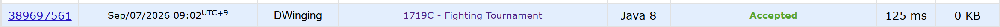

### Codeforces 1719C [Fighting Tournament](https://codeforces.com/problemset/problem/1719/C) (Java)

> **날짜:** 2026년 9월 7일 <br>
> **알고리즘:** 구현, 두 포인터<br>
> **언어:**  Java <br>
> **핵심 키워드:** 구현, 두 포인터

## 📌 문제 개요

* `n`명의 선수가 번호 순서대로 줄을 선다.
* 각 선수는 서로 다른 힘 `a_i`를 가지며, 힘이 더 큰 선수가 항상 승리한다.
* 매 라운드마다 줄의 앞 두 선수가 싸운다.
* 승자는 맨 앞에 남고, 패자는 맨 뒤로 이동한다.
* 각 쿼리 `(i, k)`에 대해 `i`번 선수가 처음 `k`라운드 동안 몇 번 승리하는지 구한다.

---

## 💡 풀이 핵심 (Core Logic)

### 1. 각 선수의 승리 가능 구간을 구한다

앞에서부터 선수들을 확인하면서 현재까지 가장 강한 선수를 유지한다.

새로운 선수가 현재 최강자보다 약하면 해당 선수는 자신의 첫 경기에서 바로 패배한다.

반대로 더 강한 선수가 등장하면 기존 최강자는 그 라운드에서 패배하고, 새로운 선수가 이후의 최강자가 된다.

이를 이용해 각 선수에 대해 다음 정보를 저장한다.

```text
sTurn[i] : 승리를 시작하는 라운드
eTurn[i] : 처음 패배하는 라운드
```

전체 선수 중 힘이 가장 강한 선수는 이후 계속 승리하므로 종료 라운드가 존재하지 않는다.

---

### 2. 쿼리는 승리 구간과 k라운드의 교집합으로 계산한다

각 선수는 승리를 시작한 이후 처음 패배하기 전까지 연속해서 승리한다.

따라서 쿼리에서 주어진 `k`가 승리 시작 라운드보다 작다면 승리 횟수는 `0`이다.

승리 구간에 포함된다면 처음 `k`라운드와 해당 선수의 승리 구간이 겹치는 길이를 계산한다.

최강 선수는 종료 라운드가 없으므로 `k`까지 계속 승리한 것으로 처리한다.

---

### 3. 전체 시간 복잡도

선수 배열을 한 번 순회하며 승리 구간을 계산하고, 각 쿼리는 `O(1)`에 처리한다.

```text
전처리: O(n)
쿼리: O(q)
전체: O(n + q)
```

---

## 🧠 회고 및 결론

얼핏 보기에는 모든 라운드를 직접 진행해야 하는 시뮬레이션 문제처럼 보인다. 하지만 경기에서 한 번 패배한 선수는 줄의 맨 뒤로 이동하고, 그 선수가 다시 앞으로 돌아오기 전에 자신보다 강한 선수가 앞을 차지하게 되므로 이후에는 승리할 수 없다.

따라서 가장 강한 선수 한 명을 제외하면 각 선수의 승리는 하나의 연속된 구간으로 표현할 수 있다.

각 선수가 승리할 수 있는 구간을 미리 전처리한 뒤, 쿼리마다 해당 구간과 `k`라운드까지의 범위를 비교하여 승리 횟수를 계산하는 것이 핵심이다.


---

### 📂 소스 코드
*   [Solution.java](./Solution.java)
 
---

### 🖥️ 실행 결과



---