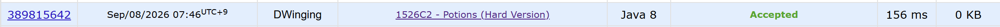

### Codeforces 1526C2 [Potions (Hard Version)](https://codeforces.com/problemset/problem/1526/C2) (Java)

> **날짜:** 2026년 9월 8일 <br>
> **알고리즘:** 자료구조, 그리디 <br>
> **언어:**  Java <br>
> **핵심 키워드:** 자료구조, 그리디

## 📌 문제 개요

* `n`개의 물약이 일렬로 놓여 있다.
* 각 물약을 마시면 체력이 `a_i`만큼 변하며, 값이 음수인 경우 체력이 감소한다.
* 첫 번째 물약부터 마지막 물약까지 순서대로 확인하며, 각 물약을 마시거나 건너뛸 수 있다.
* 물약을 마시는 모든 과정에서 체력은 항상 `0` 이상이어야 한다.
* 조건을 만족하면서 마실 수 있는 물약의 최대 개수를 구한다.

---

## 💡 풀이 핵심 (Core Logic)

### 1. 가능한 물약은 우선 선택한다

양수 물약은 체력을 증가시키므로 항상 선택해도 불리하지 않다.

음수 물약도 현재 체력으로 감당할 수 있다면 우선 선택한다.

이때 선택한 음수 물약들은 우선순위 큐에 저장한다.

---

### 2. 체력이 부족하면 더 손해가 큰 음수 물약을 교체한다

현재 음수 물약을 마실 수 없는 경우, 지금까지 선택한 음수 물약 중 가장 값이 작은 물약을 확인한다.

기존 물약보다 현재 물약의 값이 더 크다면 기존 물약을 제거하고 현재 물약으로 교체한다.

이를 통해 선택한 물약의 개수는 유지하면서 전체 체력을 더 크게 만들 수 있고, 이후 물약을 선택할 가능성도 높일 수 있다.

---

### 3. 전체 시간 복잡도

각 물약을 한 번씩 확인하며, 음수 물약의 추가 및 제거는 우선순위 큐를 사용한다.

```text
물약 순회: O(n)
우선순위 큐 연산: O(log n)

전체: O(n log n)
```

---

## 🧠 회고 및 결론
 
백트래킹과 일반적인 상태 DP를 적용하기 어렵도록 범위를 크게 만든 문제다. 그래서 순차적으로 탐색하면서, 음수 물약의 개수를 최대로 만드는 것이 핵심이었다.

---

### 📂 소스 코드
*   [Solution.java](./Solution.java)
 
---

### 🖥️ 실행 결과



---