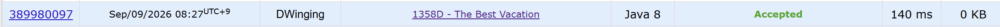

### Codeforces 1358D [The Best Vacation](https://codeforces.com/problemset/problem/1358/D) (Java)

> **날짜:** 2026년 9월 9일 <br>
> **알고리즘:** 두 포인터 <br>
> **언어:**  Java <br>
> **핵심 키워드:** 두 포인터

## 📌 문제 개요

* 1년은 `n`개의 달로 구성되며, `i`번째 달은 `d_i`일이다.
* 각 달의 `j`번째 날에 방문하면 `j`번의 포옹을 받을 수 있다.
* 정확히 `x`일 동안 연속해서 방문해야 한다.
* 방문 기간은 연도를 넘어갈 수 있으므로 달의 배열은 원형으로 이어진다고 볼 수 있다.
* 연속된 `x`일 동안 받을 수 있는 포옹 수의 최댓값을 구한다.

---

## 💡 풀이 핵심 (Core Logic)

### 1. 원형 구간을 처리하기 위해 배열을 두 배로 확장한다

방문 기간이 연도를 넘어갈 수 있으므로 기존 달 배열을 한 번 더 이어 붙인다.

이를 통해 원형 구간을 일반적인 연속 구간처럼 처리할 수 있다.

---

### 2. 두 포인터로 `x`일 이상이 되는 구간을 유지한다

오른쪽 포인터를 이동하며 월 단위로 날짜 수와 포옹 수를 누적한다.

현재 구간의 날짜 수가 `x`일 이상이 되면 왼쪽에서 월 전체를 제거할 수 있는지 확인한다.

왼쪽 월을 제거한 뒤에도 `x`일 이상이라면 해당 월은 통째로 제외한다.

---

### 3. 경계 월의 초과 날짜만 제외한다

월 단위 제거가 끝나면 왼쪽 경계 월은 일부만 포함되는 상태가 된다.

현재 날짜 수가 `x`보다 `k`일 많다면, 왼쪽 경계 월의 앞쪽 `k`일을 제외한다.

앞쪽 `k`일의 포옹 수는 다음 연속합 공식으로 계산한다.

```text
1 + 2 + ... + k
= k(k + 1) / 2
```

전체 포옹 수에서 이 값을 제외하여 정확히 `x`일 동안의 포옹 수를 계산한다.

---

### 4. 전체 시간 복잡도

각 포인터는 배열을 한 방향으로만 이동한다.

```text
배열 확장: O(n)

두 포인터 탐색: O(n)

전체: O(n)
```

---

## 🧠 회고 및 결론

1900점이지만, 익숙한 두 포인터라 발상은 어렵지 않았다. 월을 기준으로 두 포인터를 굴리되, 경계에 해당하는 월을 어떻게 정리해야할지 고민을 많이 했다.

처음에는 왼쪽 경계와 오른쪽 경계를 모두 고려해야 한다고 생각했다. 하지만 오른쪽 경계 월을 일부 사용하는 경우보다 해당 월을 끝까지 포함하고 왼쪽 경계 월의 앞부분을 제외하는 경우가 더 큰 포옹 수를 만들 수 있으므로, 왼쪽 경계만 처리하면 된다고 판단했다.

코드 디버깅에 AI의 도움을 받긴 했지만, 이정도 난이도라면 혼자서도 충분히 풀 수 있는 레벨이었다.

---

### 📂 소스 코드
*   [Solution.java](./Solution.java)
 
---

### 🖥️ 실행 결과




---