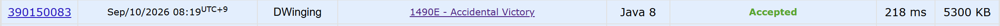

### Codeforces 1490E [Accidental Victory](https://codeforces.com/problemset/problem/1490/E) (Java)

> **날짜:** 2026년 9월 10일 <br>
> **알고리즘:** 정렬, 자료구조, 그리디 <br>
> **언어:**  Java <br>
> **핵심 키워드:** 정렬, 자료구조, 그리디

## 📌 문제 개요

* `n`명의 플레이어는 각각 `a_i`개의 토큰을 가지고 있다.
* 두 플레이어가 대결하면 토큰이 더 많은 플레이어가 승리하고, 패자의 토큰을 모두 가져간다.
* 토큰 수가 같다면 어느 쪽도 승리할 수 있다.
* 최종적으로 우승할 가능성이 있는 모든 플레이어를 구한다.

---

## 💡 풀이 핵심 (Core Logic)

### 1. 토큰 수를 기준으로 오름차순 정렬한다

약한 플레이어부터 차례대로 토큰을 흡수한다고 생각한다.

각 플레이어의 원래 번호도 함께 저장한다.

---

### 2. 약한 상대를 모두 이긴 뒤 다음 상대를 이길 수 있는지 확인한다

현재까지의 토큰 합을 `sum`이라 할 때 다음 플레이어의 토큰이 `a[i]`라면,

```text
sum >= a[i]
```

이면 지금까지의 플레이어는 다음 상대까지 이길 가능성이 있다.

반대로,

```text
sum < a[i]
```

이면 앞의 모든 플레이어가 힘을 합쳐도 `a[i]`를 이길 수 없으므로 이전 후보들은 모두 탈락한다.

따라서 **마지막으로 `sum < a[i]`가 발생한 지점부터 끝까지의 플레이어가 우승 가능한 후보**가 된다.

---

### 3. 전체 시간 복잡도

```text
정렬: O(n log n)
탐색: O(n)

전체: O(n log n)
```
---

## 🧠 회고 및 결론

우승할 가능성이 있는 선수를 구하면 되는 간단한 문제였다.

---

### 📂 소스 코드
*   [Solution.java](./Soluition.java)
 
---

### 🖥️ 실행 결과



---