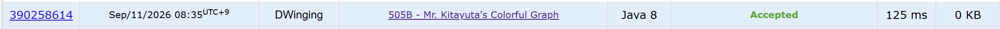

### Codeforces 505B [Mr. Kitayuta's Colorful Graph](https://codeforces.com/problemset/problem/505/B) (Java)

> **날짜:** 2026년 9월 11일 <br>
> **알고리즘:** 그래프 탐색, BFS <br>
> **언어:**  Java <br>
> **핵심 키워드:** 그래프 탐색, BFS

## 📌 문제 개요

* `n`개의 정점과 `m`개의 간선으로 이루어진 무방향 그래프가 주어진다.

* 각 간선은 하나의 색상 `c`를 가지며, 동일한 두 정점 사이에도 서로 다른 색상의 간선이 여러 개 존재할 수 있다.

* 각 쿼리마다 두 정점 `u`, `v`가 주어진다.

* 하나의 색상만 사용하여 `u`에서 `v`까지 직접 또는 간접적으로 이동할 수 있을 때, 해당 색상을 유효한 색상으로 판단한다.

* 각 쿼리에 대해 조건을 만족하는 색상의 개수를 구한다.

---

## 💡 풀이 핵심 (Core Logic)

### 1. 정점과 색상을 하나의 탐색 상태로 관리한다

같은 정점에 도달하더라도 사용 중인 색상이 다르면 서로 다른 상태로 처리해야 한다.

따라서 방문 여부를 다음과 같이 관리한다.

```text
visited[vertex][color]
```

즉, BFS의 상태를 단순한 정점이 아니라

```text
(현재 정점, 사용 중인 색상)
```

으로 확장한다.

---

### 2. 시작 정점과 연결된 각 간선을 초기 상태로 등록한다

시작 정점 `s`와 연결된 모든 간선을 확인하고,

```text
(인접 정점, 해당 간선의 색상)
```

을 각각 BFS 큐에 삽입한다.

이후 탐색에서는 처음 선택된 색상을 유지해야 하므로 현재 상태의 색상과 동일한 간선만 이동할 수 있다.

```text
currentColor == nextColor
```

인 경우에만 다음 정점으로 이동한다.

이를 통해 하나의 탐색 상태에서는 처음 선택한 색상의 간선만을 이용한 경로를 확인할 수 있다.

---

### 3. 도착 정점에 도달한 색상의 개수를 계산한다

BFS 과정에서 상태 `(e, color)`에 도달했다면 해당 `color`의 간선만 사용하여 시작 정점 `s`에서 도착 정점 `e`까지 이동할 수 있다는 의미이다.

따라서 도착 정점에 도달한 서로 다른 색상의 개수를 정답으로 계산한다.

`visited[vertex][color]`를 사용하므로 동일한 색상으로 같은 정점에 여러 경로를 통해 도달하더라도 하나의 상태로만 처리된다.

---

### 4. 방문 배열은 쿼리 번호를 이용해 재사용한다

각 쿼리마다 `visited` 배열 전체를 초기화하는 대신 현재 쿼리 번호를 `mark`로 사용한다.

```text
visited[vertex][color] = mark
```

현재 값이 `mark`보다 작다면 이번 쿼리에서 아직 방문하지 않은 상태로 판단한다.

이를 통해 매 쿼리마다 방문 배열을 별도로 초기화하지 않고 동일한 배열을 재사용할 수 있다.

---

### 5. 전체 시간 복잡도

각 쿼리마다 가능한 `(정점, 색상)` 상태를 탐색한다.

```text
상태 수: O(n × m)
쿼리 수: q
전체: O(q × n × m)
```

문제의 제한이

```text
n, m, q ≤ 100
```

이므로 충분히 처리할 수 있다.

---

## 🧠 회고 및 결론

그래프 탐색 과정에서 색상을 유지하면 되는 간단한 문제다.

---

### 📂 소스 코드
*   [Solution.java](./Solution.java)
 
---

### 🖥️ 실행 결과



---