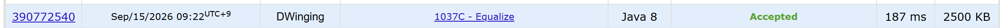

### Codeforces 1037C [Equalize](https://codeforces.com/problemset/problem/1037/C) (Java)

> **날짜:** 2026년 9월 15일  
> **알고리즘:** 그리디  
> **언어:**  Java  
> **핵심 키워드:** 그리디

## 📌 문제 개요

* 같은 길이의 두 이진 문자열 `a`, `b`가 주어진다.

* 문자열 `a`에 대해 두 가지 연산을 수행할 수 있다.

  * 두 인덱스 `i`, `j`의 비트를 교환하며 비용은 `|i - j|`이다.
  * 하나의 인덱스를 선택해 비트를 뒤집으며 비용은 `1`이다.

* 문자열 `b`는 변경할 수 없다.

* 문자열 `a`를 `b`와 동일하게 만들기 위한 **최소 비용**을 구한다.

---

## 💡 풀이 핵심 (Core Logic)

### 1. 서로 다른 위치만 확인한다

`a[i] == b[i]`인 위치는 이미 조건을 만족하므로 별도의 연산이 필요하지 않다.

따라서 두 문자열의 값이 서로 다른 위치만 대상으로 처리한다.

### 2. 인접한 두 불일치는 교환으로 한 번에 해결할 수 있다

현재 위치 `i`와 다음 위치 `i + 1`이 모두 불일치하고,

`a[i] == b[i + 1]`, `a[i + 1] == b[i]`

를 만족하면 두 비트를 교환하여 두 위치를 동시에 해결할 수 있다.

인접한 위치의 교환 비용은 `1`이므로 각각 뒤집는 비용 `2`보다 작다.

### 3. 교환할 수 없다면 현재 비트를 뒤집는다

인접한 두 위치를 교환하여 함께 해결할 수 없는 경우에는 현재 위치의 비트를 뒤집는다.

뒤집기 비용은 항상 `1`이므로 현재 위치를 즉시 처리할 수 있다.

### 4. 앞에서부터 그리디하게 처리한다

문자열을 왼쪽부터 탐색하면서 현재 불일치가 다음 위치와 함께 해결 가능한지만 확인한다.

교환이 가능하면 두 위치를 한 번에 처리하고, 그렇지 않으면 현재 위치만 뒤집는다.

### 5. 시간 복잡도

문자열을 한 번 순회하므로 시간 복잡도는 `O(n)`이다.

---

## 🧠 회고 및 결론
 
이전에 풀었던 촛불 끄기의 쉬운 난이도 버전이다. 값을 변경할 필요가 없어서 풀이를 이해한다면, 로직을 간결하게 작성할 수 있다.

---

### 📂 소스 코드
*   [Solution.java](./Solution.java)
 
---

### 🖥️ 실행 결과

---