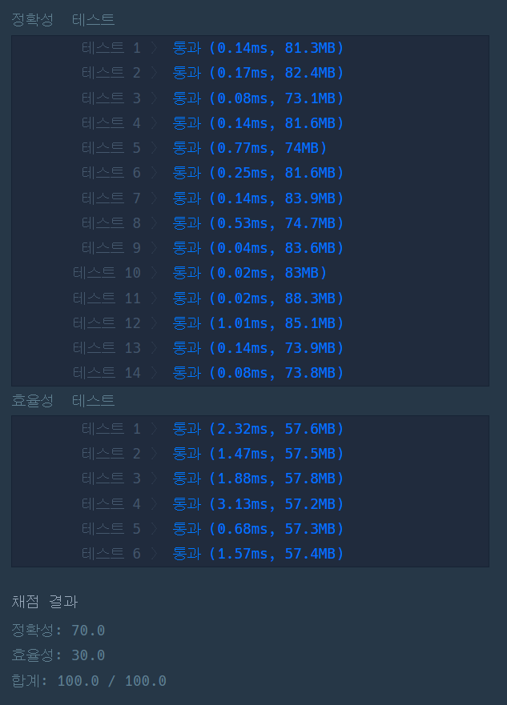

### 프로그래머스 Lv3 [선입 선출 스케줄링](https://school.programmers.co.kr/learn/courses/30/lessons/12920) (Java)

> **날짜:** 2026년 9월 16일  
> **알고리즘:** 이분 탐색  
> **언어:**  Java  
> **핵심 키워드:** 파라매트릭 서치

## 📌 문제 개요

* `n`개의 동일한 작업과 여러 개의 CPU 코어가 주어진다.

* 각 코어는 서로 다른 작업 처리 시간을 가진다.

* 코어가 작업을 완료하면 대기 중인 다음 작업을 즉시 처리한다.

* 여러 코어가 동시에 작업 가능한 상태가 되면 **코어 번호가 작은 순서대로** 작업이 배정된다.

* `n`번째 마지막 작업이 배정되는 **코어의 번호**를 구한다.

---

## 💡 풀이 핵심 (Core Logic)

### 1. 시간을 기준으로 이분 탐색한다

직접 작업을 하나씩 배정하지 않고, 특정 시간 `t`까지 몇 개의 작업이 배정될 수 있는지를 계산한다.

시간이 증가할수록 배정 가능한 작업의 수는 감소하지 않으므로 이분 탐색을 적용할 수 있다.

### 2. 특정 시간까지 배정된 작업 수를 계산한다

시간 `0`에는 모든 코어가 하나의 작업을 바로 시작하므로 초기 작업 수는 코어의 개수이다.

이후 각 코어가 시간 `t`까지 추가로 처리할 수 있는 작업 수는 `t / cores[i]`이다.

따라서 전체 작업 수를 합산하여 `n`개 이상의 작업이 배정되는지 확인한다.

### 3. `n`개 이상 처리 가능한 최소 시간을 찾는다

이분 탐색을 통해 시간 `t`까지 배정된 작업 수가 `n` 이상이 되는 **최소 시간**을 찾는다.

같은 시간에 여러 코어가 동시에 작업을 완료할 수 있으므로 작업 수가 정확히 `n`이 되는 시간이 아니라 `n` 이상이 되는 최초 시간을 기준으로 탐색한다.

### 4. 마지막 작업이 배정되는 코어를 찾는다

찾은 시간 `t`의 직전까지 배정된 작업 수를 계산한다.

이후 시간 `t`에 작업이 끝나는 코어를 번호순으로 확인하면서 작업 수를 하나씩 증가시킨다.

작업 수가 `n`이 되는 순간의 코어가 마지막 작업을 처리하는 코어이다.

### 5. 시간 복잡도

각 이분 탐색 단계마다 모든 코어를 한 번 확인한다.

따라서 시간 복잡도는 `O(C log T)`이다.

* `C`: 코어의 개수
* `T`: 탐색하는 최대 시간 범위

---

## 🧠 회고 및 결론

이전에 풀었던 경험이 있는 유형의 문제다. 이분 탐색에 취약하다 보니 발상이 어려웠고, AI의 도움을 받았다.

한동안은 이분 탐색 문제를 풀면서 발상을 키워야겠다.

---

### 📂 소스 코드
*   [Solution.java](./Solution.java)
 
---

### 🖥️ 실행 결과

---