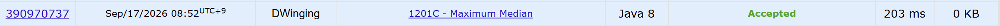
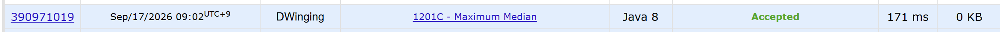

### Codeforces 1400 [Maximum Median](https://codeforces.com/problemset/problem/1201/C) (Java)

> **날짜:** 2026년 09월 17일  
> **알고리즘:** 이분 탐색, 정렬  
> **언어:** Java  
> **핵심 키워드:** 이분 탐색, 정렬, 파라매트릭 서치

## 📌 문제 개요

- 홀수 길이의 정수 배열과 최대 연산 횟수 `k`가 주어진다.
- 한 번의 연산으로 배열의 원소 하나를 `1` 증가시킬 수 있다.
- 연산은 최대 `k`번 수행할 수 있다.
- 배열을 비내림차순으로 정렬했을 때 가운데 원소를 중앙값으로 정의한다.
- 가능한 연산 안에서 만들 수 있는 중앙값의 최댓값을 구한다.

---

## 💡 풀이 핵심 (Core Logic)

### 1. 정렬 후 중앙값 이상 구간만 확인

배열을 정렬하면 중앙값의 위치는 `n / 2`로 고정된다. 중앙값보다 앞선 원소를 증가시켜도 중앙값의 최댓값을 높이는 데 도움이 되지 않으므로, 두 풀이 모두 중앙값부터 배열의 끝까지만 비용 계산에 사용한다.

### 2. 목표 중앙값을 파라매트릭 서치

목표 중앙값을 `mid`로 정하고, 중앙값 이후의 원소 중 `mid`보다 작은 값을 모두 `mid`까지 올리는 비용을 구한다. 이 비용이 `k` 이하면 `mid`를 만들 수 있으므로 탐색 구간의 왼쪽을 올리고, 초과하면 오른쪽을 내린다. 가능한 최댓값을 찾아야 하므로 upper bound 형태의 이분 탐색을 사용한다.

### 3. 두 코드의 비용 계산 방식

`Solution1.java`는 중앙값 위치부터 순회하며 `mid - arr[i]`를 직접 누적하고, 정렬된 배열에서 `mid` 이상을 만나면 순회를 끝낸다. `Solution2.java`는 `lowerBound`로 `mid`보다 작은 구간의 끝을 찾고, 누적 합을 이용해 `mid * 원소 수 - 구간 합`으로 같은 비용을 계산한다.

### 시간 복잡도

- `Solution1.java`: 정렬에 `O(n log n)`, 값 이분 탐색의 각 판정에 `O(n)`이 필요하므로 `O(n log n + n log M)`
- `Solution2.java`: 정렬과 누적 합 구성에 `O(n log n)`, 각 판정의 lower bound에 `O(log n)`이 필요하므로 `O(n log n + log n log M)`
- `M`: 이분 탐색 상한인 `arr[n / 2] + k`

---

## 🧠 회고 및 결론

파라매트릭 서치와 Lower Bound를 섞어 사용하는 문제였다. Lower Bound는 문제에서 강제하지 않지만, 연습삼아 적용해보았다.

왜 이분 탐색을 사용해야하고, 파라매트릭 서치를 적용해야하는가 라는 관점에서 좋은 문제라고 생각한다.

---

### 📂 소스 코드

- [Solution1.java](./Solution1.java)
- [Solution2.java](./Solution2.java)

---

### 🖥️ 실행 결과

---
