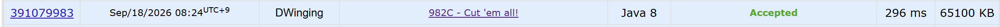

### Codeforces 1500 [982C - Cut 'em all!](https://codeforces.com/problemset/problem/982/C) (Java)

> **날짜:** 2026년 09월 18일  
> **알고리즘:** 트리, DFS, 그리디  
> **언어:** Java  
> **핵심 키워드:** 트리, DFS, 그리디

## 📌 문제 개요

- `n`개의 정점과 `n - 1`개의 간선으로 이루어진 트리가 주어진다.
- 간선을 제거한 뒤 남은 모든 연결 요소의 정점 수는 짝수여야 한다.
- 전체 정점 수가 홀수라 조건을 만족할 수 없다면 `-1`을 출력한다.
- 조건을 만족하면서 제거할 수 있는 간선의 최대 개수를 구한다.

---

## 💡 풀이 핵심 (Core Logic)

### 1. 홀수 크기 트리의 불가능 여부 확인

모든 연결 요소의 크기가 짝수라면 전체 정점 수도 반드시 짝수여야 한다. 따라서 `n`이 홀수이면 DFS를 수행하지 않고 초기값 `-1`을 그대로 출력한다.

### 2. DFS 후위 순회로 서브트리 크기 계산

1번 정점을 루트로 정하고 부모 정점을 제외한 자식들을 재귀적으로 탐색한다. 각 정점은 자신의 크기 `1`에 자식 DFS가 반환한 크기를 더해 현재 서브트리의 정점 수를 계산한다.

### 3. 짝수 크기 서브트리를 즉시 분리

현재 서브트리의 크기가 짝수이면 부모와 연결된 간선을 제거해도 해당 서브트리가 유효한 연결 요소가 된다. 이때 `res`를 증가시키고 부모에게는 `0`을 반환하여 이미 분리한 정점들이 상위 서브트리 크기에 다시 포함되지 않게 한다. 루트에는 제거할 부모 간선이 없으므로 `res`를 `-1`에서 시작해 루트에서 발생하는 증가를 상쇄한다.

### 시간 복잡도

- `n`: 트리의 정점 수
- 각 정점과 간선을 한 번씩 탐색하므로 시간 복잡도는 `O(n)`이다.
- 인접 리스트와 재귀 호출 스택을 사용하므로 공간 복잡도는 `O(n)`이다.

---

## 🧠 회고 및 결론

트리, DFS, 그리디를 종합한 문제다. 익숙한 유형이라 빠르게 풀 수 있었다.

---

### 📂 소스 코드

[Solution.java](./Solution.java)

---

### 🖥️ 실행 결과

---
