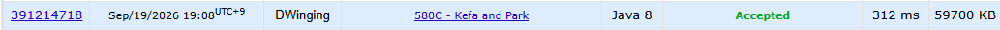

### Codeforces 1500 [580C - Kefa and Park](https://codeforces.com/problemset/problem/580/C) (Java)

> **날짜:** 2026년 09월 19일  
> **알고리즘:** 트리, DFS  
> **언어:** Java  
> **핵심 키워드:** 트리, DFS

## 📌 문제 개요

- 1번 정점을 루트이자 Kefa의 집으로 하는 `n`개 정점의 트리가 주어진다.
- 각 정점에는 고양이가 있거나 없으며, 리프 정점에는 식당이 있다.
- 집에서 식당까지 가는 경로에 고양이가 있는 정점이 `m`개를 초과하여 연속하면 해당 식당에는 갈 수 없다.
- 조건을 만족하며 도달할 수 있는 서로 다른 식당의 수를 구한다.

---

## 💡 풀이 핵심 (Core Logic)

### 1. 부모 정점을 제외하며 트리 탐색

양방향 간선을 인접 리스트에 저장한 뒤 1번 정점에서 DFS를 시작한다. 별도의 방문 배열 대신 직전 부모 정점 `p`를 다음 탐색에서 제외하여 트리를 한 방향으로 내려간다.

### 2. 연속된 고양이 수 갱신과 가지치기

현재 정점에 고양이가 있으면 이전까지의 연속 횟수에 1을 더하고, 없으면 연속이 끊겼으므로 0으로 초기화한다. 이 값이 `m`을 초과한 순간 그 아래의 모든 경로도 이미 조건을 위반하므로 `0`을 반환해 더 탐색하지 않는다.

### 3. 도달 가능한 리프 정점 집계

부모를 제외하고 방문할 자식이 없으면 현재 정점을 식당이 있는 리프로 판단해 `1`을 반환한다. 내부 정점은 각 자식 DFS의 반환값을 더해 조건을 만족하는 식당의 총개수를 상위 호출로 전달한다.

### 시간 복잡도

- `n`: 트리의 정점 수
- 각 정점과 간선을 최대 한 번씩 탐색하므로 시간 복잡도는 `O(n)`이다.
- 인접 리스트와 재귀 호출 스택을 사용하므로 공간 복잡도는 `O(n)`이다.

---

## 🧠 회고 및 결론

---

### 📂 소스 코드

[Solution.java](./Solution.java)

---

### 🖥️ 실행 결과

---
