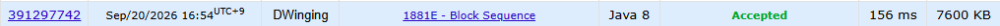

### Codeforces 1500 [Block Sequence](https://codeforces.com/problemset/problem/1881/E) (Java)

> **날짜:** 2026년 09월 20일  
> **알고리즘:** DP  
> **언어:** Java  
> **핵심 키워드:** DP

## 📌 문제 개요

- 길이 `n`인 정수 수열이 주어진다.
- 아름다운 수열은 여러 블록으로 이루어지며, 각 블록의 첫 원소는 뒤따르는 블록 원소의 개수를 나타낸다.
- 한 번의 연산으로 수열에서 임의의 원소 하나를 삭제할 수 있다.
- 주어진 수열을 아름다운 수열로 만들기 위한 최소 삭제 횟수를 구한다.

---

## 💡 풀이 핵심 (Core Logic)

### 1. 현재 위치부터 필요한 최소 삭제 횟수를 DP 상태로 정의

`dfs(node, n)`은 `node`부터 수열 끝까지를 아름다운 블록 수열로 만들기 위한 최소 삭제 횟수를 반환한다. `node`가 수열 끝에 도달하면 더 처리할 원소가 없으므로 0을 반환하고, 이미 계산한 위치는 `dp` 배열에서 바로 가져온다.

### 2. 현재 원소를 삭제하는 선택

현재 원소를 블록의 시작으로 사용하지 않으면 이 원소를 한 번 삭제하고 다음 위치를 처리해야 한다. 따라서 `dfs(node + 1, n) + 1`을 기본값으로 두어 어떤 위치에서도 가능한 선택을 확보한다.

### 3. 현재 원소를 블록 길이로 사용하는 선택

현재 값 `arr[node]`를 블록 길이로 사용하면 시작 원소와 그 뒤의 `arr[node]`개 원소를 유지한 채 `node + arr[node] + 1`로 이동한다. 이 위치가 수열 범위를 넘지 않을 때만 유효한 블록이므로, 이후 구간의 삭제 횟수와 현재 원소를 삭제하는 경우 중 더 작은 값을 저장한다.

### 시간 복잡도

- `n`: 각 테스트 케이스의 수열 길이
- 각 위치의 `dfs`를 한 번만 계산하므로 시간 복잡도는 `O(n)`이다.
- `dp` 배열과 재귀 호출 스택을 사용하므로 공간 복잡도는 `O(n)`이다.

---

## 🧠 회고 및 결론

---

### 📂 소스 코드

[Solution.java](./Solution.java)

---

### 🖥️ 실행 결과

---
