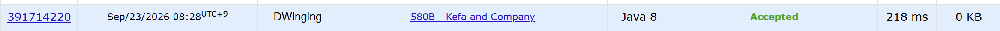

### Codeforces 1500 [Kefa and Company](https://codeforces.com/problemset/problem/580/B) (Java)

> **날짜:** 2026년 09월 23일  
> **알고리즘:** 두 포인터, 정렬  
> **언어:** Java  
> **핵심 키워드:** 두 포인터, 정렬

## 📌 문제 개요

- 각 친구는 보유한 돈과 Kefa에 대한 우정도를 가진다.
- 초대받은 친구 중 다른 친구보다 돈이 `d` 이상 적은 사람이 있으면 안 된다.
- 친구는 조건을 만족하는 범위에서 여러 명 초대할 수 있다.
- 초대할 친구들의 우정도 합의 최댓값을 구한다.

---

## 💡 풀이 핵심 (Core Logic)

### 1. 보유 금액을 기준으로 친구 정렬

각 친구의 보유 금액과 우정도를 `arr`에 저장한 뒤 보유 금액을 기준으로 오름차순 정렬한다. 그러면 함께 초대할 수 있는 친구들은 정렬된 배열에서 연속 구간을 이루므로, 양 끝의 금액 차만으로 조건 충족 여부를 판단할 수 있다.

### 2. 두 포인터로 초대 가능한 구간 확장

`left`를 현재 구간의 시작으로 두고, `arr[right][0] - arr[left][0] < d`인 동안 `right`를 이동하며 우정도를 `val`에 더한다. 금액 차가 정확히 `d`인 경우에도 가난하다고 느끼므로 엄격한 부등식 `< d`를 사용해야 한다.

### 3. 구간 합의 최댓값 갱신

각 `left`에서 조건을 만족하는 구간을 최대한 확장한 뒤 `val`로 `res`를 갱신한다. 다음 시작점으로 넘어갈 때 `arr[left][1]`을 빼면, 이미 이동한 `right`를 되돌리지 않고도 다음 유효 구간의 우정도 합을 이어서 계산할 수 있다. 우정도 합은 `int` 범위를 넘을 수 있어 `val`과 `res`를 `long`으로 관리한다.

### 시간 복잡도

- `n`: 친구 수
- 정렬에 `O(n log n)`, 두 포인터 순회에 `O(n)`이 필요하므로 전체 시간 복잡도는 `O(n log n)`이다.
- 친구 정보를 저장하는 배열을 사용하므로 공간 복잡도는 `O(n)`이다.

---

## 🧠 회고 및 결론

간단한 두 포인터 문제였다.

---

### 📂 소스 코드

[Solution.java](./Solution.java)

---

### 🖥️ 실행 결과

---
