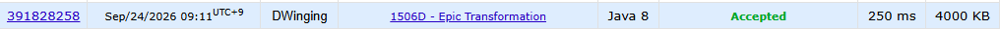

### Codeforces 1400 [Epic Transformation](https://codeforces.com/problemset/problem/1506/D) (Java)

> **날짜:** 2026년 09월 24일  
> **알고리즘:** 자료구조, 그리디  
> **언어:** Java  
> **핵심 키워드:** 빈도 수, 우선 순위 큐, 그리디

## 📌 문제 개요

- 정수로 이루어진 길이 `n`의 배열이 주어진다.
- 한 번의 연산에서 값이 서로 다른 두 원소를 선택한다.
- 선택한 두 원소를 배열에서 함께 제거하며, 이 연산은 원하는 만큼 수행할 수 있다.
- 연산을 모두 마친 뒤 남을 수 있는 배열 크기의 최솟값을 구한다.

---

## 💡 풀이 핵심 (Core Logic)

### 1. 값별 빈도 집계

배열의 각 값을 `HashMap`의 키로 사용해 등장 횟수를 센다. 새로운 값이 처음 등장할 때만 `stack`에 저장하고, 입력을 모두 읽은 뒤 이 목록을 순회해 각 값의 빈도만 최대 힙에 넣는다. 제거 가능 여부는 원소의 실제 값이 아니라 서로 다른 값이 몇 개씩 남아 있는지에 따라 결정되므로 이후 과정에서는 빈도만 관리하면 된다.

### 2. 가장 큰 두 빈도를 우선해서 상쇄

최대 힙에서 현재 빈도가 가장 큰 두 항목을 꺼내 각각 1씩 감소시킨다. 이는 서로 다른 두 값을 골라 제거하는 한 번의 연산에 해당한다. 최대 힙에서 빈도가 가장 큰 두 값을 선택해 하나씩 제거한다. 매 연산마다 서로 다른 두 값이 필요하므로, 현재 가장 많이 남은 값들을 우선 감소시켜 한 종류의 값만 남는 상황을 최대한 늦춘다.

### 3. 제거할 수 없는 원소 수 반환

힙에 빈도가 두 개 이상 남아 있는 동안에는 서로 다른 값의 원소를 계속 한 쌍씩 제거할 수 있다. 반복이 끝났을 때 힙이 비어 있으면 모든 원소를 제거한 것이므로 `0`, 하나만 남아 있으면 더 이상 다른 값과 짝지을 수 없으므로 그 남은 빈도를 답으로 출력한다.

### 시간 복잡도

- `n`: 한 테스트 케이스의 원소 수
- `k`: 서로 다른 값의 수
- 빈도 집계에 평균 `O(n)`, 최대 힙 연산에 `O(n log k)`가 필요하므로 전체 시간 복잡도는 `O(n log k)`이다.
- 빈도 맵, 서로 다른 값 목록, 최대 힙에 `O(k)`의 추가 공간을 사용한다.

---

## 🧠 회고 및 결론

자료구조의 이해도를 요구하는 그리디 문제로, 수학적 원리를 적용해도 풀 수 있다.

---

### 📂 소스 코드

[Solution.java](./Solution.java)

---

### 🖥️ 실행 결과

---
