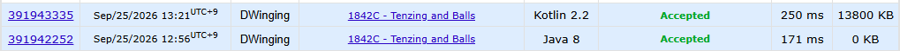

### Codeforces 1500 [1842C - Tenzing and Balls](https://codeforces.com/problemset/problem/1842/C) (Java, Kotlin)

> **날짜:** 2026년 09월 25일  
> **알고리즘:** DP  
> **언어:** Java, Kotlin  
> **핵심 키워드:** DP

## 📌 문제 개요

- 일렬로 놓인 `n`개 공의 색을 나타내는 배열이 주어진다.
- 현재 배열에서 색이 같은 두 공을 선택할 수 있다.
- 선택한 두 공과 그 사이에 있는 모든 공을 한 번에 제거하며, 이 연산은 여러 번 수행할 수 있다.
- 모든 연산을 마친 뒤 제거할 수 있는 공의 최대 개수를 구한다.

---

## 💡 풀이 핵심 (Core Logic)

### 1. 제거한 개수 대신 남은 공의 최솟값 정의

`dp[i]`를 원래 배열의 첫 `i`개 공을 처리했을 때 남길 수 있는 공의 최소 개수로 정의한다. 최종적으로 전체 공의 수 `n`에서 `dp[n]`을 빼면 제거할 수 있는 공의 최대 개수를 얻을 수 있다.

### 2. 현재 공을 남기는 전이

현재 공을 삭제 구간의 끝으로 사용하지 않는다면 앞의 `i - 1`개를 최적으로 처리한 상태에 이 공 하나가 남는다. 따라서 기본값을 `dp[i - 1] + 1`로 설정한다.

### 3. 같은 색의 이전 공부터 현재 공까지 제거

현재 색 `v`가 앞선 위치 `j`에도 있었다면 `j`번째 공부터 현재 공까지 한 번에 제거할 수 있으므로, 그 앞부분만 처리한 상태인 `dp[j - 1]`을 그대로 이어받는다. `best[v]`에는 지금까지 색 `v`가 등장한 각 위치 직전의 `dp` 최솟값을 저장하여 모든 이전 위치를 다시 순회하지 않고 `dp[i] = min(dp[i - 1] + 1, best[v])`로 갱신한다. 이후 현재 위치가 다음 같은 색 구간의 시작이 될 수 있도록 `best[v]`에 `dp[i - 1]`을 반영한다.

### 4. 최대 제거 개수 계산

모든 위치의 전이를 마치면 `dp[n]`은 남아야 하는 공의 최소 개수이다. 각 구현은 `n - dp[n]`을 출력해 최대 제거 개수로 변환한다.

### 시간 복잡도

각 테스트 케이스에서 모든 공을 한 번씩 확인하고 배열로 색별 최솟값을 조회하므로 시간 복잡도는 `O(n)`, 추가 공간 복잡도는 `O(n)`이다. 전체 테스트 케이스의 `n` 합을 `N`이라고 하면 전체 시간 복잡도는 `O(N)`이다.

- `n`: 한 테스트 케이스의 공 개수
- `N`: 모든 테스트 케이스의 공 개수 합

---

## 🧠 회고 및 결론

DP에서 어떤 값을 상태로 관리할지 정하는 과정이 중요했던 문제였다. 처음에는 같은 색 공이 나온 모든 위치를 저장했지만, 실제로는 이전 위치들의 최적값만 유지하면 된다는 점을 통해 상태를 압축하는 방법을 다시 확인할 수 있었다. DP 상태 관리 연습 문제로 굉장히 좋았다.

---

### 📂 소스 코드

[Solution.java](./Solution.java)

[Solution.kt](./Solution.kt)

---

### 🖥️ 실행 결과

---
