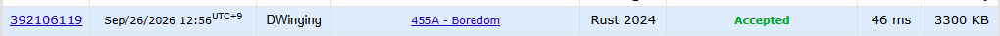

### Codeforces 1500 [455A - Boredom](https://codeforces.com/problemset/problem/455/A) (Rust)

> **날짜:** 2026년 09월 26일  
> **알고리즘:** DP  
> **언어:** Rust  
> **핵심 키워드:** DP

## 📌 문제 개요

- `n`개의 정수로 이루어진 수열이 주어진다.
- 한 번의 연산에서 수열의 원소 하나를 선택해 그 값만큼 점수를 얻는다.
- 값을 `x`로 선택하면 선택한 원소와 함께 값이 `x - 1` 또는 `x + 1`인 모든 원소가 삭제된다.
- 연산을 여러 번 수행해 얻을 수 있는 최대 점수를 구한다.

---

## 💡 풀이 핵심 (Core Logic)

### 1. 값별 빈도 집계

같은 값 `x`를 한 번 선택하면 인접한 값들이 모두 사라진 뒤에도 남은 `x`들을 계속 선택할 수 있다. 따라서 입력 순서 대신 각 값의 등장 횟수 `arr[x]`를 세고, 값 `x`를 선택했을 때 얻는 총점을 `x * arr[x]`로 묶어 처리한다.

### 2. 현재 값을 선택하는 상태

`dp[x][0]`을 값 `x`를 선택했을 때 `1`부터 `x`까지 얻을 수 있는 최대 점수로 둔다. `x`를 선택하면 인접한 값 `x - 1`은 선택할 수 없으므로, 이전 값에서 선택하지 않은 상태인 `dp[x - 1][1]`에 `x * arr[x]`를 더한다.

### 3. 현재 값을 선택하지 않는 상태

`dp[x][1]`을 값 `x`를 선택하지 않았을 때의 최대 점수로 둔다. 이 경우 `x - 1`의 선택 여부에는 제한이 없으므로 `dp[x - 1][0]`과 `dp[x - 1][1]` 중 큰 값을 이어받는다. 최댓값까지 순회한 뒤 두 상태 중 큰 값을 출력한다.

### 시간 복잡도

입력 원소를 한 번씩 집계하고 `1`부터 입력의 최댓값까지 순회하므로 시간 복잡도는 `O(n + M)`, 추가 공간 복잡도는 `O(K)`이다.

- `n`: 수열의 원소 개수
- `M`: 입력에 등장한 최댓값
- `K`: 코드에서 사용하는 값의 상한 `100,000`

---

## 🧠 회고 및 결론

DP 기초 유형 중 하나인 선택/비선택 문제다. 입력된 배열을 그대로 활용하지 않는 것이 특징이다.

---

### 📂 소스 코드

[main.rs](./main.rs)

---

### 🖥️ 실행 결과

---
