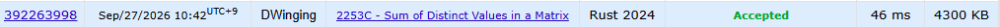

### Codeforces 1500 [2253C - Sum of Distinct Values in a Matrix](https://codeforces.com/problemset/problem/2253/C) (Rust)

> **날짜:** 2026년 09월 27일  
> **알고리즘:** 두 포인터, 그리디  
> **언어:** Rust  
> **핵심 키워드:** 두 포인터, 그리디

## 📌 문제 개요

- 모든 원소가 `0`인 `n × m` 행렬과, 원소가 각각 엄격히 증가하는 두 배열 `a`, `b`가 주어진다.
- 한 연산에서는 `a`의 값 하나를 골라 행 전체를 그 값으로 덮어쓸 수 있다.
- 다른 연산에서는 `b`의 값 하나를 골라 열 전체를 그 값으로 덮어쓸 수 있다.
- 행, 열, 값은 여러 번 선택할 수 있으며 연산 순서와 횟수에는 제한이 없다.
- 최종 행렬에 한 번 이상 나타나는 서로 다른 값들의 합을 최대화해야 한다.

---

## 💡 풀이 핵심 (Core Logic)

### 1. 큰 값부터 비교하는 두 포인터

두 배열은 이미 오름차순이므로 `x`, `y`를 각 배열의 마지막 원소에 두고 큰 값부터 비교한다. 최대 합을 만들려면 현재 남은 값 중 큰 값을 우선 선택해야 하므로, 별도의 정렬 없이 두 배열을 내림차순으로 병합하듯 탐색한다.

### 2. 행과 열에서 선택할 수 있는 값의 수 관리

서로 다른 값은 최대 `n + m - 1`개까지 행렬에 남길 수 있다. 코드의 `remain_total`은 아직 선택할 수 있는 전체 값의 수를, `remain_a`와 `remain_b`는 각각 행과 열에서 추가로 선택할 수 있는 값의 수를 나타낸다. 두 값이 다르면 더 큰 쪽을 먼저 합산하되, 해당 배열의 남은 선택 수가 있을 때만 결과와 카운트를 갱신한다. 선택 한도가 찬 뒤에도 포인터는 계속 이동해 더 작은 후보를 건너뛴다.

### 3. 두 배열의 공통 값은 한 번만 합산

두 포인터가 가리키는 값이 같으면 최종 행렬의 서로 다른 값에는 한 번만 기여하므로 `res`에 한 번만 더하고 두 포인터를 함께 이동한다. 이 값은 행과 열 양쪽에서 사용할 수 있으므로 한쪽의 개별 선택 수를 차감하지 않고 전체 선택 수만 하나 줄인다. 한 배열을 모두 확인한 뒤에는 다른 배열의 남은 값을 같은 방식으로 선택하며 탐색을 마친다.

### 시간 복잡도

각 포인터는 배열을 뒤에서 앞으로 한 번씩만 이동하므로 테스트 케이스 하나의 시간 복잡도는 `O(x + y)`, 두 배열을 저장하는 추가 공간 복잡도는 `O(x + y)`이다.

- `x`: 배열 `a`의 길이
- `y`: 배열 `b`의 길이

---

## 🧠 회고 및 결론

재미있는 두 포인터 문제였다. 러스트 언어가 익숙하지 않아 문제 푸는 게 까다로웠다.

---

### 📂 소스 코드

[main.rs](./main.rs)

---

### 🖥️ 실행 결과

---
