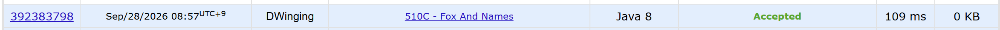

### Codeforces 1600 [Fox And Names](https://codeforces.com/problemset/problem/510/C) (Java)

> **날짜:** 2026년 09월 28일  
> **알고리즘:** 문자열, 그래프 이론, 위상 정렬  
> **언어:** Java  
> **핵심 키워드:** 위상 정렬, 사전순 정렬

## 📌 문제 개요

- 서로 다른 소문자 이름 `n`개가 주어진 순서대로 나열되어 있다.
- 알파벳 문자의 순서를 바꾸었을 때 모든 이름이 사전순이 되어야 한다.
- 두 이름은 처음으로 다른 문자의 알파벳 순서로 비교하고, 한 이름이 다른 이름의 접두사라면 짧은 이름이 앞선다.
- 조건을 만족하는 알파벳 순서가 존재하면 가능한 순서 하나를, 존재하지 않으면 `Impossible`을 출력한다.

---

## 💡 풀이 핵심 (Core Logic)

### 1. 인접한 이름에서 문자 간 선후관계 추출

주어진 전체 목록이 사전순이려면 각 인접한 이름 쌍도 순서가 맞아야 한다. 두 이름을 앞에서부터 비교하여 처음 다른 문자 `u`, `v`를 찾고, `u`가 `v`보다 앞서야 한다는 방향 간선 `u → v`를 추가한다. 처음 다른 위치 이후의 문자는 두 이름의 순서를 결정하지 않으므로 비교를 종료한다.

### 2. 잘못된 접두사 순서 판별

서로 다른 문자를 찾지 못했다면 둘 중 하나가 다른 하나의 접두사다. 이때 앞 이름이 더 길면 어떤 알파벳 순서에서도 사전순이 될 수 없으므로 즉시 불가능한 상태로 기록한다.

### 3. 26개 문자 위상 정렬

모든 소문자 중 진입 차수가 0인 문자를 배열 큐에 넣고, 하나씩 꺼내 결과에 추가하면서 연결된 문자의 진입 차수를 줄인다. 26개 문자를 모두 꺼냈다면 얻은 순서가 조건을 만족하는 알파벳 순서다. 처리한 문자가 26개보다 적다면 선후관계 그래프에 사이클이 있으므로 `Impossible`을 반환한다.

### 시간 복잡도

- `S`: 입력으로 주어진 모든 이름 길이의 합
- 인접 문자열 비교와 입력 처리에 `O(S)`, 위상 정렬에 `O(26 + E)`가 필요하다.
- 인접한 이름 쌍마다 최대 하나의 간선을 추가하므로 `E ≤ n - 1`이고, 전체 시간 복잡도는 `O(S + n)`이다.

---

## 🧠 회고 및 결론

문자열의 사전순 조건을 문자 간 선후관계로 바꾸고, 이를 위상 정렬로 연결하는 발상이 까다로웠다.

오랜만에 푸는 위상 정렬 문제라 발상이 늦었지만, 문자열과 그래프를 연결하는 과정이 재밌는 문제였다.

---

### 📂 소스 코드

[Solution.java](./Solution.java)

---

### 🖥️ 실행 결과

---
