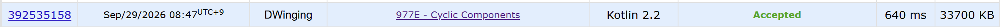

### Codeforces 1500 [Cyclic Components](https://codeforces.com/problemset/problem/977/E) (Kotlin)

> **날짜:** 2026년 09월 29일  
> **문제 번호:** 977E  
> **알고리즘:** BFS, DFS, 그래프 이론, DSU  
> **언어:** Kotlin  
> **핵심 키워드:** BFS, DFS, DSU, 사이클 판별

## 📌 문제 개요

- 정점 `n`개와 간선 `m`개로 이루어진 무방향 단순 그래프가 주어진다.
- 연결 요소가 사이클이려면 정점을 순환하는 서로 다른 간선들만 포함해야 한다.
- 하나의 사이클은 3개 이상의 정점으로 이루어진다.
- 그래프에서 사이클 자체를 이루는 연결 요소의 개수를 구한다.

---

## 💡 풀이 핵심 (Core Logic)

### 1. 무방향 인접 리스트 구성

각 간선을 양쪽 정점의 인접 리스트에 모두 추가한다. 이후 한 정점에서 BFS를 시작하면 같은 연결 요소에 속한 모든 정점을 방문하면서 각 정점의 차수도 바로 확인할 수 있다.

### 2. 방문하지 않은 정점마다 연결 요소 탐색

`1`번부터 `n`번 정점까지 확인하며 아직 방문하지 않은 정점을 새로운 연결 요소의 시작점으로 삼는다. BFS 큐에 넣을 때 방문 처리하여 같은 정점이 중복으로 들어가지 않게 하고, 연결 요소 전체를 한 번씩만 탐색한다.

### 3. 모든 정점의 차수가 2인지 확인

무방향 단순 그래프의 연결 요소가 하나의 사이클이려면 그 안의 모든 정점이 정확히 두 이웃과 연결되어야 한다. BFS 중 차수가 2가 아닌 정점을 하나라도 만나면 해당 요소를 사이클이 아닌 것으로 표시하고, 끝까지 모든 정점의 차수가 2였던 연결 요소만 정답에 더한다.

### 시간 복잡도

- `n`: 정점 수
- `m`: 간선 수
- 각 정점과 간선을 한 번씩 확인하므로 시간 복잡도는 `O(n + m)`이다.

---

## 🧠 회고 및 결론

단순한 사이클이 만들어지는 조건을 생각해보면 쉽게 풀리는 문제다.

---

### 📂 소스 코드

[Solution.kt](./Solution.kt)

---

### 🖥️ 실행 결과

---
