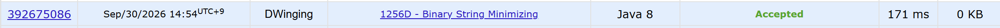

### Codeforces 1500 [Binary String Minimizing](https://codeforces.com/problemset/problem/1256/D) (Java)

> **날짜:** 2026년 09월 30일  
> **문제 번호:** 1256D  
> **알고리즘:** 그리디  
> **언어:** Java  
> **핵심 키워드:** 그리디

## 📌 문제 개요

- 각 테스트 케이스마다 길이 `n`의 이진 문자열과 교환 횟수 제한 `k`가 주어진다.
- 한 번의 연산으로 서로 인접한 두 문자를 교환할 수 있다.
- 연산은 최대 `k`번 수행할 수 있으며, 한 번도 수행하지 않아도 된다.
- 제한된 연산으로 만들 수 있는 사전순으로 가장 작은 문자열을 구한다.

---

## 💡 풀이 핵심 (Core Logic)

### 1. 앞서 읽은 1의 출력 보류

문자열을 왼쪽부터 읽으면서 `1`을 만나면 바로 출력하지 않고 `pendingOnes`에 개수를 누적한다. 이후 만나는 `0`을 이 `1`들보다 앞으로 옮기면 문자열을 사전순으로 줄일 수 있으므로, 배치가 정해질 때까지 출력을 미룬다. 교환 횟수 `k`는 큰 값을 처리할 수 있도록 `long`으로 읽는다.

### 2. 교환 횟수에 따라 0의 위치 결정

`0`을 만나면 보류한 `1`을 모두 넘는 데 필요한 교환 횟수 `pendingOnes`를 `k`에서 뺀다. 결과인 `remain`이 0 이상이면 현재 `0`을 바로 결과에 추가하고, 보류한 `1`들은 다음 `0`도 앞에 배치할 수 있도록 유지한다. 사전순 비교에서는 앞쪽 문자가 우선하므로, 먼저 만난 `0`부터 가능한 가장 앞에 배치한다.

교환 횟수가 부족하면 `-remain`개의 `1`을 먼저 출력하고 그만큼 `pendingOnes`를 줄인 뒤 `0`을 출력한다. 이는 현재 `0`이 넘을 수 없는 `1`만 앞에 남기는 것으로, 남아 있던 교환 횟수를 모두 사용하는 배치다. 코드에서는 이때 `k`가 음수가 되어 추가 이동을 처리하는 반복문이 종료된다.

### 3. 보류한 1과 남은 문자열 출력

문자열을 끝까지 읽었거나 `k <= 0`이 되면 보류한 `1`을 모두 결과에 추가한다. 이후 아직 읽지 않은 문자들은 순서대로 붙인다. 교환 횟수가 소진된 뒤에는 더 이상 순서를 바꿀 수 없으므로 남은 부분을 그대로 유지한다. 각 테스트 케이스의 결과는 하나의 `StringBuilder`에 모아 마지막에 출력한다.

### 시간 복잡도

- `n`: 한 테스트 케이스의 문자열 길이
- 각 문자를 한 번 읽고 한 번 출력하며, 보류한 `1`도 전체 과정에서 각각 한 번만 출력하므로 테스트 케이스당 `O(n)`이다.
- 모든 테스트 케이스를 합친 시간 복잡도는 `O(Σn)`이다.

---

## 🧠 회고 및 결론

로직이 간단한 그리디 문제다. 문자열을 잘라서 사용하면 쉽게 풀수 있다.

---

### 📂 소스 코드

[Solution.java](./Solution.java)

---

### 🖥️ 실행 결과

---
