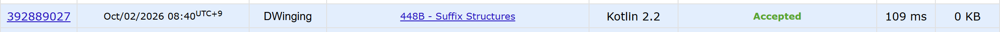

### Codeforces 1400 [Suffix Structures](https://codeforces.com/problemset/problem/448/B) (Kotlin)

> **날짜:** 2026년 10월 02일  
> **문제 번호:** 448B  
> **알고리즘:** 문자열  
> **언어:** Kotlin  
> **핵심 키워드:** 문자열

## 📌 문제 개요

- 서로 다른 두 소문자 문자열 `s`와 `t`가 주어진다.
- automaton 연산은 문자열에서 임의의 문자 하나를 삭제한다.
- array 연산은 문자열의 임의의 두 문자를 서로 교환한다.
- 두 연산은 원하는 순서로 각각 여러 번 사용할 수 있다.
- `s`를 `t`로 바꾸기 위해 필요한 연산 종류에 따라 `automaton`, `array`, `both`, `need tree` 중 하나를 출력한다.

---

## 💡 풀이 핵심 (Core Logic)

### 1. 문자 개수로 변환 가능 여부와 재배열만 필요한 경우 판별

`automaton` 함수는 `str1`의 각 알파벳 개수를 센 뒤 `str2`의 문자를 하나씩 차감한다. 필요한 문자가 하나라도 부족하면 삭제와 교환을 함께 사용해도 만들 수 없으므로 `-1`을 반환해 `need tree`로 판정한다. 모든 문자가 충분하면서 두 문자열의 길이가 같으면 문자 구성이 동일하므로 교환만 필요한 `array`로 판정한다.

### 2. 부분 수열 검사로 삭제만 가능한지 확인

문자 구성이 충분하고 길이가 다르면 `isNotSubsequence` 함수가 두 포인터로 `str2`가 `str1`의 부분 수열인지 검사한다. `str2`의 각 문자를 순서대로 찾을 수 있다면 나머지 문자만 삭제하면 되므로 `automaton`을 출력한다.

### 3. 삭제와 교환이 모두 필요한 경우 구분

필요한 문자는 모두 존재하지만 `str2`가 `str1`의 부분 수열이 아니라면 삭제만으로는 문자 순서를 맞출 수 없다. 이 경우 불필요한 문자를 삭제한 뒤 남은 문자를 재배열해야 하므로 `both`를 출력한다.

### 시간 복잡도

- `n`: `str1`의 길이
- `m`: `str2`의 길이
- 두 문자열의 문자 개수 확인과 부분 수열 검사를 각각 한 번씩 수행하므로 시간 복잡도는 `O(n + m)`이다.
- 크기가 26으로 고정된 배열만 사용하므로 추가 공간 복잡도는 `O(1)`이다.

---

## 🧠 회고 및 결론

연산 가능 여부를 판별하는 문제다. 문자열의 길이가 최대 100이기 때문에 무난하게 풀 수 있다.

---

### 📂 소스 코드

[Solution.kt](./Solution.kt)

---

### 🖥️ 실행 결과

---