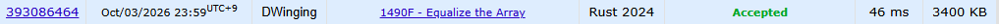

### Codeforces 1500 [1490F - Equalize the Array](https://codeforces.com/problemset/problem/1490/F) (Rust)

> **날짜:** 2026년 10월 04일  
> **알고리즘:** 정렬, 자료구조, 수학, 그리디  
> **언어:** Rust  
> **핵심 키워드:** 정렬, 카운팅, 수학, 그리디

## 📌 문제 개요

- 여러 테스트 케이스마다 길이 `n`인 정수 배열이 주어진다.
- 어떤 정수 `C`가 존재해, 남아 있는 각 값이 정확히 `C`번씩 등장하면 배열은 아름답다.
- 배열의 원소를 일부 제거해 각 값의 등장 횟수를 같게 만들 수 있다.
- 배열을 아름답게 만들기 위해 제거해야 하는 원소의 최솟값을 구한다.

---

## 💡 풀이 핵심 (Core Logic)

### 1. 값별 등장 횟수 집계

`HashMap`으로 배열의 각 값이 몇 번 등장하는지 센다. 아름다운 배열에서는 실제 값이 아니라 남길 값들의 등장 횟수가 같아야 하므로, 이후 계산에는 맵의 빈도 값만 사용한다.

### 2. 빈도 정렬과 기준 빈도 선택

등장 횟수들을 `arr`에 모아 오름차순으로 정렬한다. 최종 공통 빈도는 기존에 존재하는 등장 횟수 중 하나로 정해도 충분하므로, 코드는 서로 다른 빈도가 시작되는 위치만 후보로 확인한다.

### 3. 후보별 삭제 수 계산

후보 빈도를 `arr[s]`로 정하면 그보다 적게 등장한 값은 전부 제거하고, 나머지 값은 각각 `arr[s]`개만 남긴다. 따라서 남는 원소 수는 `arr[s] * (arr.len() - s)`이고, 전체 길이 `n`에서 이를 뺀 삭제 수의 최솟값을 `res`에 저장한다.

### 시간 복잡도

서로 다른 값의 개수를 `k`라고 할 때, 빈도 집계에 평균 `O(n)`, 빈도 정렬에 `O(k log k)`, 후보 탐색에 `O(k)`가 필요하므로 전체 시간 복잡도는 `O(n + k log k)`이다. 빈도 맵과 배열을 저장하는 추가 공간 복잡도는 `O(k)`이다.

- `n`: 배열의 길이
- `k`: 서로 다른 값의 개수

---

## 🧠 회고 및 결론

빈도 수를 카운트하고, 삭제 연산하는 숫자를 계산하는 문제였다. 풀이가 어려운 문제는 아니지만 수학적 발상이 필요하다.

---

### 📂 소스 코드

[main.rs](./main.rs)

---

### 🖥️ 실행 결과

---
