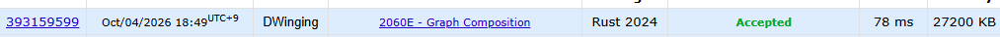

### Codeforces 1500 [Graph Composition](https://codeforces.com/problemset/problem/2060/E) (Rust)

> **날짜:** 2026년 10월 04일  
> **문제 번호:** 2060E  
> **알고리즘:** 분리 집합, 그리디, 그래프 이론  
> **언어:** Rust  
> **핵심 키워드:** Union-Find, DSU, 그리디

## 📌 문제 개요

- 같은 `n`개의 정점을 갖는 두 단순 무방향 그래프 `F`와 `G`가 주어진다.
- 그래프 `F`에서는 기존 간선을 하나 삭제하거나, 없는 간선을 하나 추가할 수 있다.
- 모든 정점 쌍이 `F`에서 연결되는 경우와 `G`에서 연결되는 경우가 서로 같아야 한다.
- 각 테스트 케이스에서 이 조건을 만족하도록 `F`를 바꾸는 최소 연산 횟수를 구한다.

---

## 💡 풀이 핵심 (Core Logic)

### 1. 그래프 G의 연결 요소 구성

`G`의 모든 간선을 `g_parents`에 합쳐 목표가 되는 연결 요소를 먼저 만든다. 최종적으로 `F`의 연결 관계는 이 요소 구분과 정확히 같아야 하므로, 이후 각 `F` 간선을 유지할 수 있는지 판단하는 기준으로 사용한다.

### 2. G의 요소를 가로지르는 F 간선 제거

각 `F` 간선의 양 끝점이 `G`에서 서로 다른 루트에 속하면, 이 간선을 남겨 두는 한 `G`에는 없는 연결 관계가 생긴다. 따라서 해당 간선은 반드시 제거해야 하며 `cnt`를 증가시킨다. 같은 `G` 요소 안에 있는 간선만 `f_parents`에 합쳐 제거 후 `F`의 연결 요소를 구성한다.

### 3. 부족한 연결을 최소 간선으로 보완

잘못된 간선을 제외한 `F`의 연결 요소 수에서 `G`의 연결 요소 수를 빼면, 각 `G` 요소 내부에서 분리된 `F` 요소들을 하나로 합치는 데 필요한 최소 간선 수가 된다. 이 값에 앞서 센 필수 삭제 횟수 `cnt`를 더해 최소 연산 횟수를 출력한다.

### 시간 복잡도

- `n`: 정점 수, `m1`: `F`의 간선 수, `m2`: `G`의 간선 수
- 경로 압축을 적용한 DSU 연산을 사용하므로 테스트 케이스당 시간 복잡도는 `O((n + m1 + m2) α(n))`이다.
- 두 그래프의 간선 목록과 두 DSU 배열을 저장하므로 공간 복잡도는 `O(n + m1 + m2)`이다.

---

## 🧠 회고 및 결론

DSU 알고리즘에 취약한 상태에서 Rust로 문제를 풀어서 더욱 까다롭게 느껴졌다.
간선을 자르고, 다시 연결하는 유형의 문제에서 발상이 아직 어렵다.
익숙한 언어로 조금 더 풀어봐야겠다.

---

### 📂 소스 코드

[main.rs](./main.rs)

---

### 🖥️ 실행 결과

---
