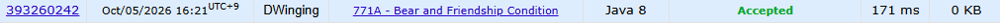

### Codeforces 1500 [Bear and Friendship Condition](https://codeforces.com/problemset/problem/771/A) (Java)

> **날짜:** 2026년 10월 05일  
> **문제 번호:** 771A  
> **알고리즘:** 분리 집합  
> **언어:** Java  
> **핵심 키워드:** Union-Find, DSU, 수학

## 📌 문제 개요

- `n`명의 회원과 서로 친구인 `m`개의 회원 쌍으로 이루어진 무방향 네트워크가 주어진다.
- 한 회원은 자기 자신과 친구가 아니며, 같은 친구 쌍은 중복해서 주어지지 않는다.
- 서로 다른 세 회원 `X`, `Y`, `Z`에 대해 `X-Y`와 `Y-Z`가 친구라면 `X-Z`도 친구여야 한다.
- 주어진 네트워크가 모든 세 회원에 대해 이 조건을 만족하는지 판별한다.

---

## 💡 풀이 핵심 (Core Logic)

### 1. 친구 관계를 연결 요소로 통합

각 회원을 하나의 집합으로 초기화하고, 친구 쌍 `(u, v)`를 읽을 때마다 두 루트를 찾는다. 루트가 다르면 `v`가 속한 집합을 `u`가 속한 집합에 합치면서 루트에 저장된 정점 수와 기존 간선 수를 함께 누적한다. 경로 압축을 적용한 `find`로 이후 루트 탐색 비용을 줄인다.

### 2. 연결 요소별 간선 수 집계

두 정점이 이미 같은 집합에 속하더라도 입력된 친구 관계는 해당 연결 요소의 간선 하나이므로, 매 친구 쌍마다 통합 후 루트의 `edge` 값을 증가시킨다. 가능한 간선 수가 `int` 범위를 넘을 수 있어 간선 수는 `long`으로 관리한다.

### 3. 각 연결 요소가 완전 그래프인지 확인

친구 관계의 전이 조건을 만족하려면 같은 연결 요소 안의 모든 두 회원이 직접 친구여야 한다. 따라서 루트마다 정점 수가 `V`일 때 실제 간선 수가 완전 그래프의 간선 수 `V(V-1)/2`와 같은지 검사하고, 하나라도 다르면 `NO`, 모두 같으면 `YES`를 출력한다.

### 시간 복잡도

- `n`: 회원 수, `m`: 친구 관계 수
- 경로 압축을 사용하는 DSU 연산과 루트 순회에 `O((n + m) log n)`의 시간이 걸린다.
- 부모, 정점 수, 간선 수 배열을 사용하므로 공간 복잡도는 `O(n)`이다.

---

## 🧠 회고 및 결론

Union-Find를 연습하기 좋은 문제다. 문제 해석에 시간이 소모되었지만, 코드 구현 난이도는 무난한 편이다.

---

### 📂 소스 코드

[Solution.java](./Solution.java)

---

### 🖥️ 실행 결과

---
