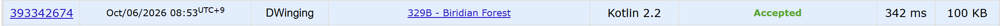

### Codeforces 1500 [Biridian Forest](https://codeforces.com/problemset/problem/329/B) (Kotlin)

> **날짜:** 2026년 10월 06일  
> **문제 번호:** 329B  
> **알고리즘:** BFS, DFS, 그래프 탐색  
> **언어:** Kotlin  
> **핵심 키워드:** BFS, 그래프 탐색

## 📌 문제 개요

- 최대 `1000 × 1000` 격자에 시작점 `S`, 출구 `E`, 통과할 수 없는 나무 `T`, 각 칸의 상대 트레이너 수를 나타내는 숫자 `0~9`가 주어진다.
- 시작점에서 출구까지 이동할 수 있음이 보장된다.
- 한 번의 행동으로 제자리에 머물거나 상하좌우로 한 칸 이동할 수 있으며, 출구에서는 숲을 떠날 수 있다.
- 내가 한 번 행동한 뒤 다른 트레이너들도 각각 동시에 한 번 행동하며, 이들은 미리 공개된 내 이동 계획을 이용해 가능하다면 나와 만나려 한다.
- 같은 칸에서 만난 상대와는 각각 한 번씩 전투하며, 전투를 마친 상대는 숲을 떠난다.
- 이동 계획을 선택하여 숲을 떠날 때까지 치러야 하는 전투 횟수의 최솟값을 구한다.

---

## 💡 풀이 핵심 (Core Logic)

### 1. 출구를 기준으로 탐색 시작

`findStartPoint`는 이름과 달리 격자에서 출구 `E`의 좌표를 찾는다. 출구까지의 최단 거리가 시작점 `S`의 최단 거리 이하인 상대는 출구에서 기다려 전투할 수 있으므로, 출구를 기준으로 거리를 비교한다. 최단 경로로 탈출하면 이보다 먼 상대와는 만날 수 없어 해당 범위의 인원수만 합산하면 된다.

### 2. BFS로 가까운 칸부터 인원수 누적

`solve`는 출구를 방문 처리하고 `IntArray` 큐에 넣은 뒤 BFS를 수행한다. `check`로 격자 범위를 확인하고, 나무가 아니면서 아직 방문하지 않은 인접 칸만 큐에 추가한다. 큐에 넣을 때 방문 처리하여 같은 칸의 인원수를 중복 합산하지 않는다. 새로 발견한 칸이 숫자이면 그 값을 `res`에 더한다. 좌표는 열에 10비트를 할당해 정수 하나로 저장한다.

### 3. 시작점을 발견한 거리까지 빠짐없이 처리

각 반복의 시작에 `len = right - left`를 저장하여 현재 거리의 칸만 꺼내고 다음 거리의 칸들을 발견한다. 이 과정에서 `S`를 만나면 `flag`만 설정하고 `repeat(len)`은 끝까지 수행한다. 즉시 종료하면 `S`와 출구까지의 거리가 같은 다른 칸을 놓칠 수 있기 때문이다. 현재 묶음의 처리가 끝난 뒤 탐색을 종료하면 `S`까지의 최단 거리 이하인 숫자 칸만 누적되어 있으며, 그 합을 반환한다.

### 시간 복잡도

- `n`: 격자의 행 수
- `m`: 격자의 열 수
- 출구 탐색에 `O(nm)`이 필요하고, BFS에서 각 칸을 최대 한 번 방문하며 네 방향을 확인하므로 전체 시간 복잡도는 `O(nm)`이다.
- 방문 배열과 최대 `n × m`개의 좌표를 담는 큐를 사용하므로 추가 공간 복잡도는 `O(nm)`이다.

---

## 🧠 회고 및 결론

재밌는 문제다. 결국에 모든 트레이너가 출구에서 모인다라는 발상을 할 수 있어야 풀 수 있는 문제다.

내 위치와 상대 트레이너 위치 사이의 관계를 구하려고 하니 접근이 어려웠다.

---

### 📂 소스 코드

[Solution.kt](./Solution.kt)

---

### 🖥️ 실행 결과

---
