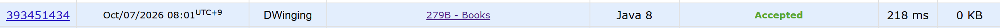

### Codeforces 1400 [Books](https://codeforces.com/problemset/problem/279/B) (Java)

> **날짜:** 2026년 10월 07일  
> **문제 번호:** 279B  
> **알고리즘:** 두 포인터  
> **언어:** Java  
> **핵심 키워드:** 두 포인터

## 📌 문제 개요

- `n`권의 책에 대해 각 책을 읽는 데 필요한 시간과 사용할 수 있는 시간이 주어진다.
- 원하는 책에서 시작하여 번호가 증가하는 순서대로 연속해서 읽는다.
- 한 권을 끝까지 읽을 시간이 부족하면 그 책은 읽지 않는다.
- 주어진 시간 안에 읽을 수 있는 책의 최대 권수를 구한다.

---

## 💡 풀이 핵심 (Core Logic)

### 1. 오른쪽 포인터를 유지하며 구간 확장

책별 시간을 books에 저장하고, 제한 시간은 m으로 입력받는다. 각 시작 위치 left에 대해 time + books[right] <= m인 동안 다음 책의 시간을 더하고 right를 증가시킨다. 읽는 시간이 모두 양수이므로 다음 책을 추가할 수 없는 지점까지 확장하면 현재 시작 위치에서 읽을 수 있는 가장 긴 구간을 얻는다. 이전에 확장한 right를 되돌리지 않아 같은 범위를 처음부터 다시 탐색하지 않는다.

### 2. 최대 권수 갱신 후 시작 위치 이동

확장이 끝나면 끝 인덱스를 포함하지 않는 구간 [left, right)의 길이 right - left로 res를 갱신한다. 이어 books[left]를 time에서 빼고 다음 시작 위치로 넘어가므로, 남은 구간의 시간을 다시 합산할 필요가 없다. 모든 시작 위치를 처리한 뒤 res를 출력한다.

코드는 빈 구간에서도 time -= books[left]를 수행한다. 한 권의 시간이 제한을 넘어서 right == left에 머문 경우에는 time이 일시적으로 음수가 된다. 다음 반복에서 같은 책의 시간을 다시 더하며 right가 새 left까지 이동해 합계가 0으로 복구된다. 따라서 time이 반복 내내 유효한 구간 합으로 유지되는 구현은 아니며, 위 보정 과정까지 포함해 동작을 해석해야 한다.

### 시간 복잡도

- n: 책의 수
- left는 n번 이동하고, 모든 반복을 합쳐 right도 최대 n번 증가하므로 전체 시간 복잡도는 O(n)이다.
- 책별 시간을 저장하는 배열을 사용하므로 공간 복잡도는 O(n)이다.

---

## 🧠 회고 및 결론

정석적인 두 포인터 문제다.

---

### 📂 소스 코드

[Solution.java](./Solution.java)

---

### 🖥️ 실행 결과

---
