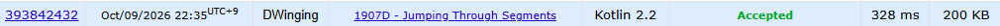

### Codeforces 1400 [Jumping Through Segments](https://codeforces.com/problemset/problem/1907/D) (Kotlin)

> **날짜:** 2026년 10월 09일  
> **문제 번호:** 1907D  
> **알고리즘:** 이분 탐색  
> **언어:** Kotlin  
> **핵심 키워드:** 파라매트릭 서치

## 📌 문제 개요

- 수직선 위에 순서가 정해진 `n`개의 구간 `[l_i, r_i]`가 주어진다.
- 플레이어는 좌표 `0`에서 시작하며, 한 번에 거리가 `k` 이하인 임의의 좌표로 이동할 수 있다.
- `i`번째 이동을 마친 좌표는 반드시 `i`번째 구간 안에 있어야 한다.
- 모든 구간을 순서대로 통과할 수 있게 하는 최소 정수 `k`를 구한다.

---

## 💡 풀이 핵심 (Core Logic)

### 1. 이동 가능한 좌표 구간으로 가능 여부 판정

`solve`는 시작 지점에서 이동 가능한 좌표 범위를 `[min, max] = [0, 0]`으로 둔다. 각 구간으로 이동할 때 기존 범위를 양쪽으로 `k`만큼 확장한 뒤 현재 구간 `[l_i, r_i]`와 교집합을 구한다. 이전 단계의 어느 좌표에서 출발하더라도 도달 가능한 위치만 다음 단계로 전달해야 이후 구간까지 통과할 수 있기 때문이다.

### 2. 교집합이 사라지는 경우 즉시 실패 처리

교집합의 왼쪽 끝은 `maxOf(min - k, l_i)`, 오른쪽 끝은 `minOf(max + k, r_i)`로 갱신한다. 갱신 후 `min > max`라면 현재 구간에 도달할 수 있는 좌표가 없으므로 즉시 `false`를 반환한다. 좌표 범위 계산은 `Long`으로 변환해 수행한다.

### 3. 가능한 최소 이동 거리 이분 탐색

어떤 `k`로 모든 구간을 통과할 수 있다면 그보다 큰 값으로도 통과할 수 있으므로 판정 결과는 단조성을 가진다. `binarySearch`는 `0`부터 `1_000_000_000`까지 탐색하면서 `solve`가 성공하면 현재 값을 결과로 저장하고 왼쪽 절반을, 실패하면 오른쪽 절반을 탐색해 가능한 최소 `k`를 찾는다.

### 시간 복잡도

- `n`: 구간의 수
- 한 번의 가능 여부 판정은 모든 구간을 순회하므로 `O(n)`이다.
- `0`부터 `10^9`까지 이분 탐색하므로 테스트 케이스당 시간 복잡도는 `O(n log 10^9)`이다.
- 입력 구간을 배열에 저장하므로 공간 복잡도는 `O(n)`이다.

---

## 🧠 회고 및 결론

파라매트릭 서치 문제다. 파라매트릭 서치까지는 쉽게 파악할 수 있었지만, 이동 판단 로직에서 실수가 나왔다.

---

### 📂 소스 코드

[Main.kt](./Main.kt)

---

### 🖥️ 실행 결과

---
