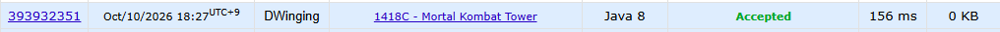
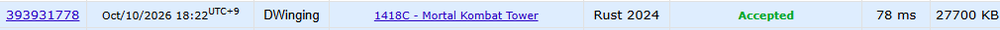
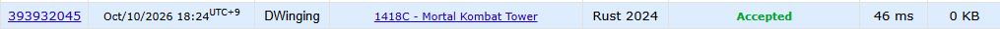

### Codeforces 1500 [1418C - Mortal Kombat Tower](https://codeforces.com/problemset/problem/1418/C) (Java, Rust)

> **날짜:** 2026년 10월 10일  
> **알고리즘:** DP, DFS, 재귀  
> **언어:** Java, Rust  
> **핵심 키워드:** DP, DFS, 재귀, TopDown, BottomUp

## 📌 문제 개요

- 순서가 정해진 `n`명의 보스가 주어지며, 각 보스는 쉬운 보스(`0`) 또는 어려운 보스(`1`)이다.
- 친구와 내가 번갈아 세션을 진행하고, 첫 세션은 친구가 시작한다.
- 매 세션에는 현재 위치부터 연속된 보스를 한 명 또는 두 명 반드시 처치한다.
- 친구가 어려운 보스를 처치할 때마다 스킵 포인트를 하나 사용한다.
- 모든 보스를 순서대로 처치할 때 친구가 사용하는 스킵 포인트의 최솟값을 구한다.

---

## 💡 풀이 핵심 (Core Logic)

### 1. 현재 위치와 차례를 DP 상태로 정의

`dp[idx][diff]`는 `idx`번째 보스부터 남은 보스를 처리할 때 필요한 스킵 포인트의 최솟값이다. `diff`가 `1`이면 친구의 차례, `0`이면 내 차례를 뜻한다. 비용이 발생하는 차례를 상태에 포함해야 같은 위치에서도 누가 처리하는지에 따라 달라지는 결과를 구분할 수 있다.

### 2. 한 명 또는 두 명을 처리하는 두 전이를 비교

현재 차례에 보스 한 명을 처리하면 `idx + 1`, 두 명을 처리하면 `idx + 2`로 이동하고 다음 차례는 `diff ^ 1`로 전환한다. 친구 차례에는 처리한 어려운 보스의 수만큼 비용을 더하고, 내 차례에는 비용을 더하지 않는다. 두 선택 중 작은 값을 저장해 이후 세션까지 포함한 최소 스킵 포인트를 구한다.

### 3. Top-Down과 Bottom-Up으로 동일한 상태 전이 계산

Top-Down 구현은 `dfs`와 `-1`로 초기화한 메모이제이션 배열을 사용해 필요한 상태를 재귀적으로 계산한다. Bottom-Up 구현은 인덱스를 뒤에서부터 순회하면서 이미 계산된 `idx + 1`, `idx + 2` 상태를 이용한다. 두 방식 모두 친구가 첫 세션을 시작하므로 `dp[0][1]`에 해당하는 값을 답으로 사용한다.

### 시간 복잡도

각 테스트 케이스에서 위치마다 두 차례 상태를 한 번씩 계산하므로 시간 복잡도는 `O(n)`, DP 배열의 공간 복잡도는 `O(n)`이다. Top-Down 구현은 재귀 호출 스택으로 `O(n)`의 추가 공간을 사용한다.

- `n`: 보스의 수

---

## 🛠 성능 최적화 인사이트 (Performance Insights)

동일한 DP 점화식을 Java 8과 Rust 2024에서 Top-Down(재귀), Bottom-Up(반복문) 방식으로 구현하고 Codeforces에서 성능을 비교했다.

| 언어 | 구현 방식 | 실행 시간 | 메모리 |
|---|---|---:|---:|
| Java 8 | Top-Down | 156ms | 10,700KB |
| Java 8 | Bottom-Up | 156ms | 0KB |
| Rust 2024 | Top-Down | 78ms | 27,700KB |
| Rust 2024 | Bottom-Up | 46ms | 0KB |

### 1. 재귀와 반복문의 성능 차이

- Java는 두 방식 모두 156ms로 실행 시간 차이가 나타나지 않았다.
- Rust는 반복문으로 변경하면서 78ms에서 46ms로 약 41% 단축되었다.
- 재귀는 호출마다 스택을 사용하지만, 반복문은 해당 비용이 발생하지 않는다.
- 두 방식 모두 `O(n)`이지만 함수 호출 비용과 메모리 접근 방식에 따라 실제 성능에 차이가 발생할 수 있다.

### 2. 언어 및 컴파일러 특성

- **Java:** JVM의 JIT 최적화와 런타임 오버헤드 등이 영향을 줄 수 있으며, 이번 측정에서는 구현 방식에 따른 시간 차이가 관측되지 않았다.
- **Rust:** 네이티브 컴파일 및 LLVM 최적화를 사용하며, 이번 측정에서는 반복문 구현이 더 빠르게 실행되었다.

단, 한 번의 측정만으로 언어 자체의 성능이나 컴파일러 최적화 수준을 단정하기는 어렵다.

### 3. Codeforces 메모리 측정

Bottom-Up 구현은 두 언어 모두 메모리가 `0KB`로 표시되었다.

하지만 DP 배열과 입력 데이터가 존재하므로 실제 메모리 사용량이 0인 것은 아니다. Codeforces의 메모리 계측 환경에 따른 결과로 보아야 한다.

재귀 구현의 메모리 사용량에는 호출 스택이 영향을 주었을 가능성이 있지만, 측정값 전체를 재귀 스택 사용량으로 해석할 수는 없다.

### 결론

동일한 `O(n)` 알고리즘이라도 재귀와 반복문, 언어별 실행 환경에 따라 성능 차이가 발생할 수 있다.

이번 실험에서는 특히 **Rust의 Bottom-Up 전환에서 실행 시간 개선이 뚜렷했다.** 따라서 재귀 깊이가 큰 DP에서는 반복문 전환을 성능 및 메모리 개선 방법으로 고려할 수 있다.

---

## 🧠 회고 및 결론

처음에는 어떻게 풀어야 할까 고민한 문제다. 한 사람이 최대 2명의 적을 처치할 수 있다고 할 때, 1명을 처치한 경우와 2명을 처치한 경우를 따로 봐야 하나 고민이 되었다.

생각해보니 Top-Down 방식의 DP 풀이가 가능하다는 사실을 떠올렸다. DP 상태에 친구의 차례인지 내 차례인지를 구분하는 값을 추가하면 된다고 판단하여 2차원 배열을 활용한 Top-Down DP로 쉽게 풀 수 있었다.

익숙한 Java로 먼저 풀고, Rust 코드를 공부하기 위해 마이그레이션을 진행했다. 이후에는 GPT를 활용하여 재귀 방식의 풀이를 반복문 형태의 Bottom-Up 풀이로 변경하여 결과를 비교해봤다. 이 결과에서 예상외의 흥미로운 사실을 알 수 있었다.

Rust는 실행 시간이 감소했고, Java는 실행 시간이 동일했다. 메모리는 두 언어 모두 Bottom-Up 구현에서 0KB로 측정되었다. 실제 메모리 사용량이 0이라는 의미는 아니지만, Codeforces의 메모리 측정 방식에 따른 특징을 확인할 수 있는 결과였다고 생각한다.

---

### 📂 소스 코드

- [Java Top-Down](./TopDown.java)
- [Java Bottom-Up](./BottomUp.java)
- [Rust Top-Down](./top_down.rs)
- [Rust Bottom-Up](./bottom_up.rs)

---

### 🖥️ 실행 결과

Java Top-Down 풀이  
   

Java Bottom-Up 풀이  
   

Rust Top-Down 풀이  
   

Rust Bottom-Up 풀이  

---
