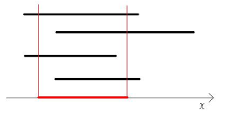

# [구간 자르기] 2283

## 📊 문제 정보
| 항목 | 내용 |
| :--- | :--- |
| 티어 | Gold II |
| 시간 제한 | 2 초 |
| 메모리 제한 | 128 MB |
| 알고리즘 | 누적 합, 스위핑, 두 포인터, 차분 배열 트릭 |
| 링크 | [백준 바로가기](https://www.acmicpc.net/problem/2283) |

---

## 📜 문제 설명

<p>수직선(數直線) 상에 구간 N개가 있다. 임의의 두 정수 A, B(A &lt; B)를 정하여, 각 구간에서 A와 B 사이에 포함되지 않은 부분을 모두 잘라냈을 때 남는 부분들의 길이의 총합이 K가 되도록 하여라.</p>

<p style="text-align: center;"></p>

### 📥 입력

<p>1번째 줄에 정수 N, K(1 ≤ N ≤ 1,000, 1 ≤ K ≤ 1,000,000,000)가 주어진다.</p>

<p>2~N+1번째 줄에 각 구간의 왼쪽 끝점과 오른쪽 끝점의 위치가 주어진다. 양 끝점의 위치는 0 이상 1,000,000 이하의 정수이다.</p>

### 📤 출력

<p>두 정수 A, B를 출력한다. 조건을 만족하는 A, B가 존재하지 않으면 “0 0”을 출력한다.</p>

<p>조건을 만족하는 A, B가 여러 개 존재할 때는 A가 가장 작은 경우를 출력한다. 그것도 여러 개 존재할 때는 B가 가장 작은 경우를 출력한다.</p>

---

## 💡 예제

### 예제 1
**Input:**
```text
4 25
0 10
3 15
0 8
3 10
```
**Output:**
```text
2 9
```

---

## 📜 나의 제출 기록

| 제출 번호 | 결과 | 메모리 | 시간 | 언어 | 제출 일자 |
| :--- | :--- | :--- | :--- | :--- | :--- |
| 102115759 | ✅ 맞았습니다!! | 16220 KB | 108 ms | Java 8 / 수정 | 2026년 1월 20일 |
| 102115658 | ✅ 맞았습니다!! | 16384 KB | 108 ms | Java 8 / 수정 | 2026년 1월 20일 |

---

## 🖼️ 이미지



