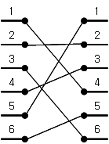
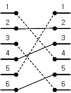

# [브리징 시그널] 3066

## 📊 문제 정보
| 항목 | 내용 |
| :--- | :--- |
| 티어 | Gold II |
| 시간 제한 | 1 초 |
| 메모리 제한 | 128 MB |
| 알고리즘 | 이분 탐색, 가장 긴 증가하는 부분 수열 문제 |
| 링크 | [백준 바로가기](https://www.acmicpc.net/problem/3066) |

---

## 📜 문제 설명

<p>
	ACM(Advanced Chip Manufacture)이라는 회사의 수석 칩(chip) 설계자인 한승이는 고민에 빠져있다. 경로 설계자들의 잘못으로 두 개의 블록의 포트를 연결하는 칩 위의 시그널들이 서로 교차하게 만들어졌다. 이 시점에서 경로 설계를 다시 하는 것은 비용이 너무 많이든다. 그 대신 엔지이너들은 교차하는 시그널들을 브리징 하기로 했다. 브리징은 시그널이 서로 교차하는 경우 하나의 시그널이 다른 시그널과 접촉하지 않도록 수직으로 띄우는 작업이다. 하지만 브리징은 어려운 작업이므로 가능하면 적은 수의 시그널만 브리징 해야한다. 실리콘 표면에서 서로 교차하지 않고 연결될 수 있는 최대 시그널의 개수를 찾는 프로그램을 작성하시오.</p>
<p>
	&nbsp;</p>
<table class="table table-bordered">
	<tbody>
		<tr>
			<td style="width:50%;text-align:center">
				</td>
			<td style="width:50%;text-align:center">
				</td>
		</tr>
		<tr>
			<td style="text-align:center">
				<strong>그림 1.</strong> 문제가 생긴 두 개의 블록의 포트와 포트를 연결하는 시그널</td>
			<td style="text-align:center">
				<strong>그림 2.</strong> 최대 세 개의 시그널이 서로 교차하지 않고 연결될 수 있다. 점선으로 표시된 시그널은 브리징 해야한다.</td>
		</tr>
	</tbody>
</table>
<p>
	&nbsp;</p>
<p>
	두 개의 블록의 포트는 1번부터 N번까지 위에서 아래로 번호가 매겨져 있다. 각 포트는 다른 블록의 한 포트와 연결된다.</p>

### 📥 입력

<p>
	입력의 첫 줄에는 테스트 케이스의 개수 T가 주어진다. 각 테스트 케이스는 첫 번째 줄에 포트의 개수 N(1 ≤ N ≤ 40000)이 주어지고, 두 번째 줄부터는 왼쪽 블록의 포트와 연결되어야 하는 오른쪽 블록의 포트 번호 k<sub>i</sub>(1 ≤ k<sub>i</sub> ≤ N)가 한 줄에 하나씩 N개 주어진다. 즉, i+1번째 줄에는 왼쪽 블록의 i번 포트와 연결되어야 하는 오른쪽 블록의 포트 번호가 주어진다.</p>

### 📤 출력

<p>
	각 테스트 케이스에 대해 서로 교차하지 않고 연결될 수 있는 최대 시그널의 개수를 한 줄에 하나씩 출력한다.</p>

---

## 💡 예제

### 예제 1
**Input:**
```text
3
6
4
2
6
3
1
5
10
2
3
4
5
6
7
8
9
10
1
9
5
8
9
2
3
1
7
4
6
```
**Output:**
```text
3
9
4
```

---

## 📜 나의 제출 기록

| 제출 번호 | 결과 | 메모리 | 시간 | 언어 | 제출 일자 |
| :--- | :--- | :--- | :--- | :--- | :--- |
| 102108605 | ✅ 맞았습니다!! | 29736 KB | 240 ms | Java 8 / 수정 | 2026년 1월 20일 |

---

## 🖼️ 이미지





