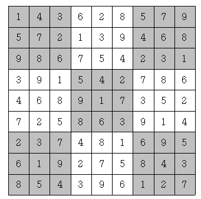

# [스도쿠] 2239

## 📊 문제 정보
| 항목 | 내용 |
| :--- | :--- |
| 티어 | Gold IV |
| 시간 제한 | 2 초 |
| 메모리 제한 | 256 MB |
| 알고리즘 | 구현, 백트래킹 |
| 링크 | [백준 바로가기](https://www.acmicpc.net/problem/2239) |

---

## 📜 문제 설명

<p>스도쿠는 매우 간단한 숫자 퍼즐이다. 9×9 크기의 보드가 있을 때, 각 행과 각 열, 그리고 9개의 3×3 크기의 보드에 1부터 9까지의 숫자가 중복 없이 나타나도록 보드를 채우면 된다. 예를 들어 다음을 보자.</p>

<p></p>

<p>위 그림은 참 잘도 스도쿠 퍼즐을 푼 경우이다. 각 행에 1부터 9까지의 숫자가 중복 없이 나오고, 각 열에 1부터 9까지의 숫자가 중복 없이 나오고, 각 3×3짜리 사각형(9개이며, 위에서 색깔로 표시되었다)에 1부터 9까지의 숫자가 중복 없이 나오기 때문이다.</p>

<p>하다 만 스도쿠 퍼즐이 주어졌을 때, 마저 끝내는 프로그램을 작성하시오.</p>

### 📥 입력

<p>9개의 줄에 9개의 숫자로 보드가 입력된다. 아직 숫자가 채워지지 않은 칸에는 0이 주어진다.</p>

### 📤 출력

<p>9개의 줄에 9개의 숫자로 답을 출력한다. 답이 여러 개 있다면 그 중 사전식으로 앞서는 것을 출력한다. 즉, 81자리의 수가 제일 작은 경우를 출력한다.</p>

---

## 💡 예제

### 예제 1
**Input:**
```text
103000509
002109400
000704000
300502006
060000050
700803004
000401000
009205800
804000107
```
**Output:**
```text
143628579
572139468
986754231
391542786
468917352
725863914
237481695
619275843
854396127
```

---

## 📜 나의 제출 기록

| 제출 번호 | 결과 | 메모리 | 시간 | 언어 | 제출 일자 |
| :--- | :--- | :--- | :--- | :--- | :--- |
| 102889963 | ✅ 맞았습니다!! | 12728 KB | 220 ms | Java 8 / 수정 | 2026년 2월 12일 |

---

## 🖼️ 이미지



